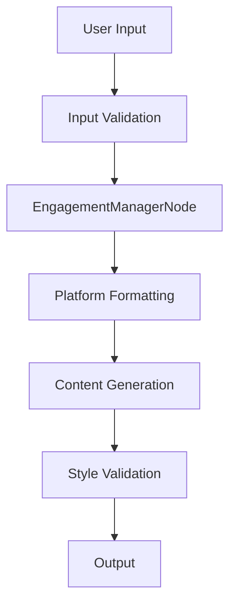

# Virtual PR Firm

A comprehensive AI-powered PR content generation system built with PocketFlow, featuring robust input validation, error handling, and testing infrastructure.

## 🎯 Project Overview

This Virtual PR Firm leverages the PocketFlow framework to create an intelligent content generation pipeline that can produce platform-specific PR content based on user requirements. The system includes comprehensive validation, security measures, and a modern web interface.

## 🚀 Key Features

- **Intelligent Content Generation**: AI-powered PR content creation for multiple platforms
- **Platform-Specific Formatting**: Tailored content for Twitter, LinkedIn, Facebook, and more
- **Robust Input Validation**: Comprehensive validation and sanitization of all inputs
- **Security-First Design**: Protection against XSS, injection attacks, and malicious inputs
- **Modern Web Interface**: Gradio-based UI with real-time progress tracking
- **Comprehensive Testing**: Full test suite with unit and integration tests
- **Error Handling**: Graceful degradation and detailed error reporting
- **Configuration Management**: Environment-based configuration with sensible defaults

## 📋 Critical TODOs Addressed

### 1. Input Validation & Security (`main.py`, `nodes.py`)
- ✅ **Comprehensive Input Validation**: Implemented `InputValidator` class with validation for platforms, topics, and intents
- ✅ **Security Measures**: Added protection against XSS, script injection, and malicious patterns
- ✅ **Input Sanitization**: Normalization and cleaning of user inputs
- ✅ **Custom Exceptions**: `ValidationError` and `SecurityError` for proper error categorization

### 2. Error Handling & Logging (`main.py`, `flow.py`, `nodes.py`)
- ✅ **Structured Logging**: Configured logging to both console and file with detailed formatting
- ✅ **Custom Exceptions**: `FlowValidationError` and `FlowExecutionError` for flow-specific errors
- ✅ **Graceful Degradation**: `exec_fallback()` methods for handling node failures
- ✅ **Comprehensive Try-Catch**: Robust error handling throughout the application

### 3. Configuration Management (`main.py`, `flow.py`)
- ✅ **Centralized Configuration**: `Config` and `FlowConfig` dataclasses for managing settings
- ✅ **Environment Variables**: Support for overriding defaults via environment variables
- ✅ **Type Safety**: Proper type hints and validation for configuration values

### 4. Testing Infrastructure (`tests/`)
- ✅ **Unit Tests**: Comprehensive test suites for `main.py`, `flow.py`, and `nodes.py`
- ✅ **Integration Tests**: End-to-end testing of component interactions
- ✅ **Test Runner**: `run_tests.py` script for easy test execution with coverage reporting
- ✅ **Mock Testing**: Proper mocking for external dependencies and streaming

### 5. Web Interface Improvements (`main.py`)
- ✅ **Modern UI**: Enhanced Gradio interface with better layout and user experience
- ✅ **Input Validation**: Real-time validation in the web interface
- ✅ **Error Display**: User-friendly error messages and feedback
- ✅ **Progress Tracking**: Streaming support for real-time updates

## 🏗️ Architecture

### Core Components

1. **EngagementManagerNode** (`nodes.py`)
   - Entry point for content generation
   - Validates and normalizes user requirements
   - Provides quality scoring and metadata

2. **Flow Orchestration** (`flow.py`)
   - Manages the content generation pipeline
   - Handles platform-specific formatting
   - Provides monitoring and metrics

3. **Web Interface** (`main.py`)
   - Gradio-based user interface
   - CLI support for automation
   - Configuration management

### Data Flow



## 🛠️ Installation

1. **Clone the repository**:
   ```bash
   git clone <repository-url>
   cd prfirm3
   ```

2. **Install dependencies**:
   ```bash
   pip install -r requirements.txt
   ```

3. **Set up environment variables** (optional):
   ```bash
   export DEFAULT_TOPIC="Your default topic"
   export MAX_TOPIC_LENGTH=500
   export REQUEST_TIMEOUT=300
   ```

## 🚀 Usage

### Web Interface

Launch the web interface:
```bash
python main.py --web
```

Or with custom configuration:
```bash
python main.py --web --config production --log-level DEBUG
```

### Command Line Interface

Run in CLI mode:
```bash
python main.py --cli
```

### Testing

Run all tests:
```bash
python run_tests.py --all
```

Run specific test types:
```bash
# Unit tests only
python run_tests.py --unit

# With coverage
python run_tests.py --coverage

# Linting only
python run_tests.py --lint
```

## 📊 Configuration

### Main Configuration (`Config`)

| Setting | Default | Description |
|---------|---------|-------------|
| `DEFAULT_TOPIC` | "Announce product" | Default topic for content generation |
| `DEFAULT_PLATFORMS` | ["twitter", "linkedin"] | Default platforms to target |
| `MAX_TOPIC_LENGTH` | 500 | Maximum topic length in characters |
| `MAX_PLATFORMS` | 10 | Maximum number of platforms |
| `REQUEST_TIMEOUT` | 300 | Request timeout in seconds |
| `MAX_RETRIES` | 3 | Maximum retry attempts |

### Flow Configuration (`FlowConfig`)

| Setting | Default | Description |
|---------|---------|-------------|
| `ENGAGEMENT_RETRIES` | 2 | Retry attempts for engagement manager |
| `FLOW_TIMEOUT` | 300 | Flow execution timeout |
| `ENABLE_METRICS` | True | Enable execution metrics collection |

## 🔒 Security Features

### Input Validation
- **Platform Validation**: Ensures only supported platforms are used
- **Topic Validation**: Length limits and content validation
- **Intent Validation**: Structured validation of platform-specific intents

### Security Measures
- **XSS Protection**: Blocks script tags and event handlers
- **Injection Prevention**: Validates against common attack patterns
- **Character Validation**: Filters suspicious and control characters
- **HTML Entity Validation**: Ensures valid HTML entities

### Error Handling
- **Graceful Degradation**: System continues with defaults when validation fails
- **Detailed Logging**: Comprehensive error tracking and reporting
- **User Feedback**: Clear error messages without exposing system details

## 🧪 Testing

### Test Structure

```
tests/
├── test_main.py      # Main module tests
├── test_flow.py      # Flow orchestration tests
└── test_nodes.py     # Node implementation tests
```

### Test Coverage

- **Unit Tests**: Individual component testing
- **Integration Tests**: Component interaction testing
- **Security Tests**: Input validation and security measures
- **Error Handling Tests**: Exception and fallback scenarios

### Running Tests

```bash
# Run all tests with coverage
python run_tests.py --all

# Run specific test file
python -m pytest tests/test_main.py -v

# Run with coverage report
python -m pytest --cov=. --cov-report=html
```

## 📈 Monitoring & Metrics

### Execution Metrics
- **Execution Time**: Flow and node execution duration
- **Error Count**: Number of errors encountered
- **Content Quality**: Quality scores for generated content
- **Platform Processing**: Number of platforms processed

### Logging
- **Structured Logs**: JSON-formatted log entries
- **Multiple Outputs**: Console and file logging
- **Error Tracking**: Detailed error context and stack traces

## 🔄 Streaming Support

The system includes streaming capabilities for real-time progress updates:

- **Milestone Events**: Progress tracking through key milestones
- **Real-time Feedback**: Live updates in the web interface
- **Error Streaming**: Immediate error notification

## 🚧 Pending TODOs

While significant progress has been made, some TODOs remain for future development:

### High Priority
- [ ] Implement `StreamingManager` utility for real-time updates
- [ ] Re-introduce and implement other nodes (`BrandBibleIngestNode`, `VoiceAlignmentNode`, etc.)
- [ ] Add authentication and session management
- [ ] Implement caching mechanisms for performance optimization

### Medium Priority
- [ ] Add file upload capabilities for brand guidelines
- [ ] Implement advanced UI features (drag-and-drop, preview)
- [ ] Add metrics dashboard and analytics
- [ ] Create mock feedback nodes for development

### Low Priority
- [ ] Add support for additional platforms
- [ ] Implement advanced content optimization
- [ ] Add multi-language support
- [ ] Create deployment automation

## 🤝 Contributing

1. **Fork the repository**
2. **Create a feature branch**: `git checkout -b feature/amazing-feature`
3. **Make your changes**: Follow the established patterns for validation, error handling, and testing
4. **Run tests**: `python run_tests.py --all`
5. **Commit your changes**: `git commit -m 'Add amazing feature'`
6. **Push to the branch**: `git push origin feature/amazing-feature`
7. **Open a Pull Request**

## 📝 License

This project is licensed under the MIT License - see the LICENSE file for details.

## 🙏 Acknowledgments

- **PocketFlow**: The minimalist LLM framework that powers this system
- **Gradio**: For the modern web interface
- **Pytest**: For the comprehensive testing framework

---

**Note**: This project is actively developed. Please check the issues and pull requests for the latest updates and known issues.
