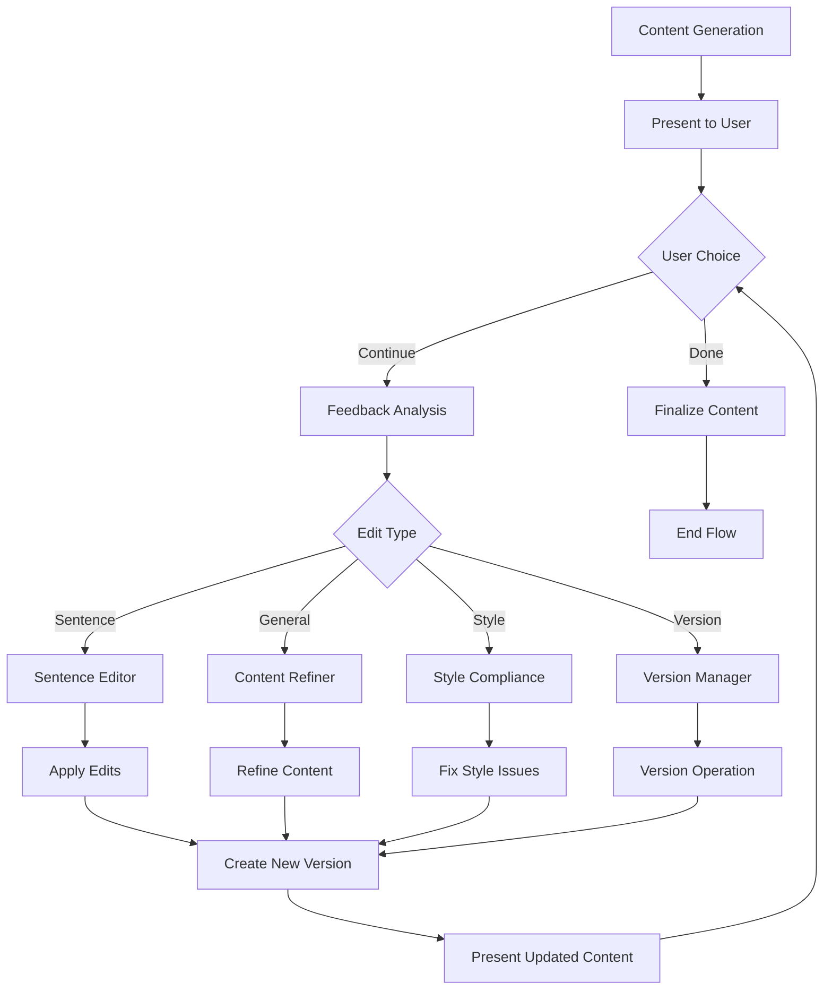
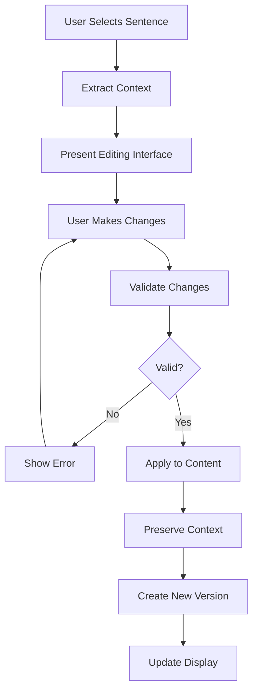

# Design Doc: Virtual PR Firm – Advanced Content System with AI-Powered UX

> Please DON'T remove notes for AI

## Requirements

> Notes for AI: Keep it simple and clear.
> If the requirements are abstract, write concrete user stories

User stories
- As a marketing manager, I want text-only, platform-optimized content (Email,
  Instagram captions, Twitter/X, Reddit, LinkedIn, Blog) that respects each
  medium's structure and limits.
- As a brand manager, I want strict voice and tone from a Brand Bible (XML) and
  consistent results across channels.
- As a creator, I want simple intake (platforms, intents, topic), milestone
  progress in chat, and full drafts once each platform completes.
- As a reviewer, I want "AI fingerprints" removed and strict bans enforced
  (no em dash, no rhetorical contrasts) with a clear revision loop (max 5)
  and a final report if edits stall.
- As a user, I want a web-based interface with real-time streaming, interactive
  feedback forms, and version comparison capabilities.
- As a content creator, I want "Done" or "Continue" feedback options, sentence-level
  editing, and versioned generations with rollback capability.
- As a team lead, I want to see conversational agent reasoning with chat bubbles
  and milestone streaming to understand the AI's decision-making process.
- As a brand manager, I want automatic XML tag usage from Brand Bibles and multiple
  XML version generation for different brand contexts.
- As a quality controller, I want "style light" checker, M-dash prevention, and
  controlled vocabulary enforcement.
- As a system administrator, I want cost tracking, OpenRouter API integration,
  JSON output fixes, and CRM integration capabilities.

Scope and constraints
- Formatting-only platform nodes. No scraping or platform research.
- Instagram: captions only (no stories).
- Reddit: user supplies subreddit name/title, rules, and description/bio (paste).
- Strict style policy:
  - Never use em dash (—).
  - Never use rhetorical contrasts/antithesis/chiasmus/paradiastole/tagline
    framing ("not just X; it's Y", "not X, but Y", etc.).
- Streaming: milestones and edit-cycle summaries only; full drafts appear per
  platform when complete.
- Presets stored locally in JSON (Brand Bible, Email signature, Blog style).
- Web interface built with Gradio for real-time interaction.
- Version control system for content iterations and rollbacks.
- Cost tracking and performance monitoring for LLM usage.

Success criteria
- All generated outputs adhere to platform guidelines and strict style policy.
- The system streams concise progress milestones and edit-loop summaries.
- Drafts publish per platform as complete (no token-level streaming).
- If the edit loop reaches 5, a concise report is streamed and the flow proceeds.
- Users can provide feedback and iterate on content through web interface.
- Version comparison and rollback functionality works seamlessly.
- Conversational agent reasoning is visible and understandable.
- Brand Bible XML integration is automatic and flexible.
- Style enforcement catches violations without being overly restrictive.
- Technical infrastructure supports cost tracking and CRM integration.

## Flow Design

> Notes for AI:
> 1. Consider the design patterns of agent, map-reduce, rag, and workflow. Apply them if they fit.
> 2. Present a concise, high-level description of the workflow.

### Applicable Design Pattern:

1. Workflow with a Manager (agent-like intake) and a strict validation pipeline.
2. Batch over selected platforms to emit guidelines and drafts per platform.
3. Map-ish scaffolding for content: section-by-section generation then assembly.
4. Agentic conversational interface with real-time streaming and feedback loops.
5. Multi-agent reasoning with chat bubble visualization for transparency.

- Agentic Manager
  - Context: user-provided topic/goal, Brand Bible (XML/preset), chosen platforms,
    per-platform intents, and (for Reddit) subreddit name/title, rules, description/bio.
  - Actions: collect/confirm inputs, propose auto-intents, save/load presets,
    stream milestones, then route execution.

### Flow high-level Design:

1. **EngagementManagerNode**: Conversational intake; collects platforms, intents
   (preset/custom/auto with confirm), topic/goal, Reddit details, Brand Bible
   (paste/preset), Email signature and Blog house style (choose/paste/save).
2. **BrandBibleIngestNode**: Parse Brand Bible XML; validate; map to persona/voice.
3. **VoiceAlignmentNode**: Normalize final voice/tone constraints; enforce forbiddens.
4. **FormatGuidelinesFlow (Batch)**: For each selected platform, emit rich Guidelines
   from the style sheet + persona_voice + intent + platform nuance knobs
   (Instagram captions only; Reddit includes pasted rules/description).
5. **ContentCraftsmanNode**: Scaffold-first generation (section budgets), assemble
   final text, and enforce hashtag/link placement rules.
6. **ValidationFlow**: StyleEditorNode → StyleComplianceNode loop (≤5) → FactValidator
   → BrandGuardian → AuthenticityAuditor.
7. **AgencyDirectorNode**: Final packaging and streaming completion.
8. **FeedbackLoopNode**: Handle "Done" or "Continue" feedback with sentence-level editing.
9. **VersionManagerNode**: Track versioned generations with rollback capability.
10. **UIStreamingNode**: Real-time streaming of milestones and agent reasoning.

```mermaid
flowchart TD
     M[EngagementManager] --> B[BrandBibleIngest]
     B --> V[VoiceAlignment]
     V --> FG[FormatGuidelinesFlow (Batch)]
     FG --> C[ContentCraftsman]
     C --> VAL[ValidationFlow]
     VAL --> D[AgencyDirector]
     D --> F[FeedbackLoopNode]
     F -->|continue| VM[VersionManagerNode]
     VM --> UI[UIStreamingNode]
     UI -->|new_version| C
     F -->|done| END[End]

     subgraph ValidationFlow
       E[StyleEditor] --> SC[StyleCompliance]
       SC -->|pass| F[FactValidator]
       SC -->|revise (<5)| E
       SC -->|max_revisions| R[EditCycleReport] --> F
       F --> G[BrandGuardian] --> A[AuthenticityAuditor]
     end

     subgraph ConversationalInterface
       CI[ChatInterface] --> AR[AgentReasoning]
       AR --> CB[ChatBubbles]
       CB --> UI
     end
```

## Gradio UI Integration

### Overview
The system integrates a Gradio-based web interface for real-time interaction, streaming, and feedback. This provides a user-friendly alternative to command-line interaction while maintaining full PocketFlow architecture compatibility.

### Key Features
- **Real-time Streaming**: Live updates of milestones, agent reasoning, and progress
- **Interactive Feedback Forms**: "Done" or "Continue" options with sentence-level editing
- **Version Comparison**: Side-by-side comparison of different content versions
- **Chat Bubble Visualization**: Show agent-to-agent communication and reasoning

### Technical Implementation
- **Gradio Interface**: Web-based UI with real-time updates via WebSocket
- **Streaming Integration**: Custom streaming utilities that work with PocketFlow nodes
- **Feedback Loop**: Interactive forms that trigger continuation or editing flows
- **Version Control**: Git-like versioning for content iterations

### UI Components
```python
# Example Gradio interface structure
interface = gr.Interface(
    fn=run_content_generation_flow,
    inputs=[
        gr.Textbox(label="Topic/Goal"),
        gr.CheckboxGroup(label="Platforms", choices=["Twitter", "LinkedIn", "Instagram", "Reddit", "Email", "Blog"]),
        gr.File(label="Brand Bible XML"),
        gr.Textbox(label="Brand Voice Description"),
        gr.Slider(label="Creativity Level", minimum=0, maximum=1, value=0.7)
    ],
    outputs=[
        gr.Markdown(label="Generated Content"),
        gr.JSON(label="Agent Reasoning"),
        gr.Chatbot(label="Agent Conversation"),
        gr.Button("Continue Editing"),
        gr.Button("Done")
    ],
    live=True
)
```

### Integration with PocketFlow
- **StreamingNode**: Extends base Node to emit real-time updates to Gradio interface
- **FeedbackNode**: Handles user feedback and triggers appropriate continuation flows
- **VersioningNode**: Manages content versions and rollback functionality

## Feedback-Driven UX Enhancement

### Overview
The system provides sophisticated feedback mechanisms allowing users to iterate on content with granular control, integrating seamlessly with PocketFlow's node-based architecture. This creates an interactive content refinement loop that maintains context across iterations while providing detailed editing capabilities.

### Key Features
- **"Done" or "Continue" Options**: Simple binary choice after each generation with intelligent routing
- **Sentence-Level Editing**: Highlight and modify specific sentences with context preservation
- **Versioned Generations**: Git-like versioning system for tracking and comparing iterations
- **Interactive Chat**: Continue conversation with agents for refinements and clarifications
- **Context Preservation**: Maintains conversation history and brand voice across iterations
- **Rollback Capability**: Easy reversion to previous versions with detailed change tracking

### Detailed "Done" or "Continue" Feedback Workflow

The feedback system operates through a sophisticated state machine that routes user decisions to appropriate processing nodes:

#### 1. Initial Content Generation
- Content is generated through the main PocketFlow pipeline
- Results are stored in `shared["content_pieces"]` with metadata
- Version 1.0 is automatically created and stored

#### 2. Feedback Presentation
- User receives content with clear "Done" or "Continue" options
- If "Continue" is selected, detailed editing options are presented:
  - **Sentence Selection**: Click-to-select individual sentences for modification
  - **General Feedback**: Text area for overall improvement requests
  - **Style Adjustments**: Specific style violation corrections
  - **Version Comparison**: Side-by-side comparison with previous versions

#### 3. Feedback Processing Decision Tree
```
User Feedback → FeedbackRouterNode
├── "Done" → FinalizeNode → End Flow
└── "Continue" → FeedbackAnalysisNode
    ├── Sentence-Level Edits → SentenceEditorNode
    ├── General Feedback → ContentRefinementNode
    ├── Style Issues → StyleComplianceNode
    └── Version Rollback → VersionManagerNode
```

#### 4. Intelligent Routing Logic
```python
class FeedbackRouterNode(Node):
    def prep(self, shared):
        return shared.get("user_feedback", {})

    def exec(self, feedback):
        feedback_type = feedback.get("type", "done")

        if feedback_type == "done":
            return "finalize"
        elif feedback_type == "continue":
            # Analyze feedback content for routing
            if "sentence_edits" in feedback:
                return "sentence_edit"
            elif "style_issues" in feedback:
                return "style_refinement"
            elif "version_rollback" in feedback:
                return "rollback"
            else:
                return "general_refinement"

    def post(self, shared, prep_res, exec_res):
        shared["feedback_route"] = exec_res
        return exec_res
```

### Sentence-Level Editing Capabilities

The sentence-level editing system provides granular control over content modification:

#### 1. Content Segmentation
```python
class SentenceSegmenter:
    def __init__(self):
        self.nlp = None  # spaCy or similar NLP library

    def segment_content(self, text):
        """Break content into editable sentence segments with metadata"""
        sentences = []
        for i, sentence in enumerate(self.nlp(text).sents):
            sentences.append({
                "id": f"sentence_{i}",
                "text": str(sentence).strip(),
                "start_pos": sentence.start_char,
                "end_pos": sentence.end_char,
                "context": self.get_context(text, sentence),
                "platform": self.detect_platform_context(sentence)
            })
        return sentences

    def get_context(self, full_text, sentence):
        """Extract surrounding context for better editing"""
        start = max(0, sentence.start_char - 100)
        end = min(len(full_text), sentence.end_char + 100)
        return full_text[start:end]
```

#### 2. Interactive Editing Interface
- **Click-to-Select**: Users can click on any sentence to select it for editing
- **Context Preservation**: Surrounding sentences are shown for context
- **Inline Editing**: Direct text modification with real-time preview
- **Suggestion Engine**: AI-powered suggestions for improvements

#### 3. Edit Processing Pipeline
```python
class SentenceEditorNode(Node):
    def prep(self, shared):
        return {
            "original_content": shared["content_pieces"],
            "sentence_edits": shared["user_feedback"]["sentence_edits"],
            "brand_voice": shared["brand_bible"]["persona_voice"]
        }

    def exec(self, inputs):
        original_content = inputs["original_content"]
        sentence_edits = inputs["sentence_edits"]
        brand_voice = inputs["brand_voice"]

        edited_content = self.apply_sentence_edits(
            original_content, sentence_edits, brand_voice
        )

        return edited_content

    def post(self, shared, prep_res, exec_res):
        # Create new version
        new_version = self.create_new_version(shared, exec_res)
        shared["content_pieces"] = exec_res
        shared["current_version"] = new_version
        return "continue"
```

### Interactive Chat Functionality

The interactive chat system enables ongoing conversation with agents for content refinement:

#### 1. Chat History Management
```python
class ChatHistoryManager:
    def __init__(self):
        self.conversations = {}

    def add_message(self, session_id, role, content, metadata=None):
        """Add a message to the conversation history"""
        if session_id not in self.conversations:
            self.conversations[session_id] = []

        message = {
            "role": role,  # "user", "assistant", "system"
            "content": content,
            "timestamp": datetime.now(),
            "metadata": metadata or {}
        }

        self.conversations[session_id].append(message)

        # Maintain context window
        self.trim_conversation(session_id)

    def get_context(self, session_id, max_tokens=4000):
        """Get relevant conversation context"""
        conversation = self.conversations.get(session_id, [])
        return self.build_context(conversation, max_tokens)
```

#### 2. Agent Communication Protocol
```python
class ContentRefinementAgent(Node):
    def prep(self, shared):
        return {
            "content": shared["content_pieces"],
            "feedback": shared["user_feedback"],
            "chat_history": shared.get("chat_history", []),
            "brand_voice": shared["brand_bible"]["persona_voice"]
        }

    def exec(self, inputs):
        content = inputs["content"]
        feedback = inputs["feedback"]
        chat_history = inputs["chat_history"]
        brand_voice = inputs["brand_voice"]

        # Build refinement prompt
        prompt = self.build_refinement_prompt(
            content, feedback, chat_history, brand_voice
        )

        # Get refined content
        refined_content = call_llm(prompt)

        return refined_content

    def post(self, shared, prep_res, exec_res):
        # Update chat history
        shared["chat_history"].append({
            "role": "assistant",
            "content": f"Content refined based on your feedback: {exec_res[:100]}...",
            "timestamp": datetime.now()
        })

        # Create new version
        new_version = self.create_version(shared, exec_res)
        shared["content_pieces"] = exec_res
        shared["current_version"] = new_version

        return "continue"
```

### Version Control & Rollback System

The system implements a comprehensive Git-like versioning and rollback system that provides complete version control capabilities for content iterations, enabling users to track changes, compare versions, and safely rollback to previous states.

#### 1. VersionManager Class Implementation

The VersionManager class provides the core functionality for version control with advanced metadata tracking and change analysis:

```python
import hashlib
import json
from datetime import datetime
from typing import Dict, List, Any, Optional
from difflib import SequenceMatcher

class VersionManager:
    def __init__(self):
        self.versions: Dict[str, Dict[str, Any]] = {}
        self.current_version: Optional[str] = None
        self.version_history: List[str] = []
        self.branches: Dict[str, str] = {"main": None}  # branch_name -> current_version
        self.current_branch = "main"

    def generate_version_id(self, content: str) -> str:
        """Generate a unique version ID based on content hash and timestamp"""
        content_hash = hashlib.sha256(content.encode('utf-8')).hexdigest()[:12]
        timestamp = datetime.now().strftime("%Y%m%d%H%M%S")
        return f"v_{timestamp}_{content_hash}"

    def create_version(self, content: str, metadata: Optional[Dict[str, Any]] = None,
                      author: str = "system", message: str = "") -> str:
        """Create a new version with comprehensive metadata"""
        version_id = self.generate_version_id(content)

        # Analyze changes from previous version
        changes_summary = self._analyze_changes(content)

        version_data = {
            "id": version_id,
            "content": content,
            "timestamp": datetime.now(),
            "author": author,
            "message": message,
            "metadata": metadata or {},
            "parent_version": self.current_version,
            "branch": self.current_branch,
            "changes_summary": changes_summary,
            "content_hash": hashlib.sha256(content.encode('utf-8')).hexdigest(),
            "word_count": len(content.split()),
            "character_count": len(content),
            "platform_tags": self._extract_platform_tags(content),
            "quality_metrics": self._calculate_quality_metrics(content)
        }

        self.versions[version_id] = version_data
        self.version_history.append(version_id)
        self.current_version = version_id
        self.branches[self.current_branch] = version_id

        return version_id

    def _analyze_changes(self, new_content: str) -> Dict[str, Any]:
        """Analyze changes between current and new content"""
        if not self.current_version:
            return {
                "change_type": "initial",
                "additions": len(new_content.split()),
                "deletions": 0,
                "modifications": 0,
                "diff_summary": "Initial version"
            }

        old_content = self.versions[self.current_version]["content"]
        matcher = SequenceMatcher(None, old_content, new_content)

        additions = max(0, len(new_content.split()) - len(old_content.split()))
        deletions = max(0, len(old_content.split()) - len(new_content.split()))

        # Calculate modifications based on diff
        modifications = 0
        for tag, i1, i2, j1, j2 in matcher.get_opcodes():
            if tag == 'replace':
                modifications += max(i2 - i1, j2 - j1)

        return {
            "change_type": "modification" if self.current_version else "initial",
            "additions": additions,
            "deletions": deletions,
            "modifications": modifications,
            "diff_summary": self._generate_diff_summary(matcher.get_opcodes()),
            "similarity_ratio": matcher.ratio()
        }

    def _generate_diff_summary(self, opcodes) -> str:
        """Generate a human-readable summary of changes"""
        summary_parts = []
        for tag, i1, i2, j1, j2 in opcodes:
            if tag == 'replace':
                summary_parts.append(f"Modified {i2 - i1} chars to {j2 - j1} chars")
            elif tag == 'delete':
                summary_parts.append(f"Deleted {i2 - i1} chars")
            elif tag == 'insert':
                summary_parts.append(f"Added {j2 - j1} chars")

        return "; ".join(summary_parts) if summary_parts else "No significant changes"

    def _extract_platform_tags(self, content: str) -> List[str]:
        """Extract platform-specific tags from content"""
        platforms = []
        if any(keyword in content.lower() for keyword in ['twitter', 'tweet', '#']):
            platforms.append('twitter')
        if any(keyword in content.lower() for keyword in ['linkedin', 'professional']):
            platforms.append('linkedin')
        if any(keyword in content.lower() for keyword in ['instagram', 'insta', '@']):
            platforms.append('instagram')
        if any(keyword in content.lower() for keyword in ['facebook', 'fb']):
            platforms.append('facebook')
        return platforms

    def _calculate_quality_metrics(self, content: str) -> Dict[str, float]:
        """Calculate basic quality metrics for the content"""
        sentences = content.split('.')
        words = content.split()

        return {
            "avg_sentence_length": len(words) / max(len(sentences), 1),
            "avg_word_length": sum(len(word) for word in words) / max(len(words), 1),
            "hashtag_density": content.count('#') / max(len(words), 1),
            "mention_density": content.count('@') / max(len(words), 1)
        }

    def rollback_to_version(self, version_id: str, create_rollback_version: bool = True) -> str:
        """Rollback to a specific version with optional rollback record"""
        if version_id not in self.versions:
            raise ValueError(f"Version {version_id} does not exist")

        target_version = self.versions[version_id]

        if create_rollback_version:
            rollback_content = target_version["content"]
            rollback_metadata = {
                "rollback_from": self.current_version,
                "rollback_reason": "User requested rollback",
                "original_timestamp": target_version["timestamp"]
            }

            return self.create_version(
                content=rollback_content,
                metadata=rollback_metadata,
                author="system",
                message=f"Rolled back to version {version_id}"
            )
        else:
            # Direct rollback without creating new version
            self.current_version = version_id
            self.branches[self.current_branch] = version_id
            return version_id

    def compare_versions(self, version_a: str, version_b: str) -> Dict[str, Any]:
        """Compare two versions and return detailed differences"""
        if version_a not in self.versions or version_b not in self.versions:
            raise ValueError("One or both versions do not exist")

        content_a = self.versions[version_a]["content"]
        content_b = self.versions[version_b]["content"]

        matcher = SequenceMatcher(None, content_a, content_b)

        return {
            "version_a": version_a,
            "version_b": version_b,
            "similarity_ratio": matcher.ratio(),
            "differences": self._generate_detailed_diff(matcher.get_opcodes(), content_a, content_b),
            "metadata_comparison": self._compare_metadata(version_a, version_b),
            "quality_comparison": self._compare_quality_metrics(version_a, version_b)
        }

    def _generate_detailed_diff(self, opcodes, content_a: str, content_b: str) -> List[Dict[str, Any]]:
        """Generate detailed diff information"""
        diff_details = []
        lines_a = content_a.split('\n')
        lines_b = content_b.split('\n')

        for tag, i1, i2, j1, j2 in opcodes:
            if tag != 'equal':
                diff_details.append({
                    "type": tag,
                    "old_content": '\n'.join(lines_a[i1:i2]),
                    "new_content": '\n'.join(lines_b[j1:j2]),
                    "old_line_range": f"{i1}-{i2}",
                    "new_line_range": f"{j1}-{j2}"
                })

        return diff_details

    def _compare_metadata(self, version_a: str, version_b: str) -> Dict[str, Any]:
        """Compare metadata between two versions"""
        meta_a = self.versions[version_a]
        meta_b = self.versions[version_b]

        return {
            "author_changed": meta_a.get("author") != meta_b.get("author"),
            "timestamp_diff": (meta_b["timestamp"] - meta_a["timestamp"]).total_seconds(),
            "word_count_change": meta_b["word_count"] - meta_a["word_count"],
            "character_count_change": meta_b["character_count"] - meta_a["character_count"]
        }

    def _compare_quality_metrics(self, version_a: str, version_b: str) -> Dict[str, Any]:
        """Compare quality metrics between versions"""
        metrics_a = self.versions[version_a]["quality_metrics"]
        metrics_b = self.versions[version_b]["quality_metrics"]

        return {
            metric: metrics_b[metric] - metrics_a[metric]
            for metric in metrics_a.keys()
        }

    def get_version_history(self, limit: Optional[int] = None) -> List[Dict[str, Any]]:
        """Get version history with optional limit"""
        history = []
        current = self.current_version

        while current and (limit is None or len(history) < limit):
            version_data = self.versions[current].copy()
            history.append(version_data)
            current = version_data.get("parent_version")

        return history

    def create_branch(self, branch_name: str, from_version: Optional[str] = None) -> None:
        """Create a new branch from specified version"""
        if branch_name in self.branches:
            raise ValueError(f"Branch {branch_name} already exists")

        from_version = from_version or self.current_version
        if from_version and from_version not in self.versions:
            raise ValueError(f"Version {from_version} does not exist")

        self.branches[branch_name] = from_version

    def switch_branch(self, branch_name: str) -> None:
        """Switch to a different branch"""
        if branch_name not in self.branches:
            raise ValueError(f"Branch {branch_name} does not exist")

        self.current_branch = branch_name
        self.current_version = self.branches[branch_name]

    def merge_branches(self, source_branch: str, target_branch: str = "main",
                      author: str = "system") -> str:
        """Merge source branch into target branch"""
        if source_branch not in self.branches or target_branch not in self.branches:
            raise ValueError("One or both branches do not exist")

        source_version = self.branches[source_branch]
        target_version = self.branches[target_branch]

        if not source_version or not target_version:
            raise ValueError("Cannot merge: one or both branches have no versions")

        # Simple merge strategy: use source content
        source_content = self.versions[source_version]["content"]
        merge_metadata = {
            "merge_source": source_branch,
            "merge_target": target_branch,
            "source_version": source_version,
            "target_version": target_version
        }

        # Switch to target branch and create merge commit
        self.switch_branch(target_branch)
        merge_version = self.create_version(
            content=source_content,
            metadata=merge_metadata,
            author=author,
            message=f"Merged branch {source_branch} into {target_branch}"
        )

        return merge_version
```

#### 2. Version Control Node Integration

The VersionManagerNode provides seamless integration with PocketFlow for version control operations:

```python
class VersionManagerNode(Node):
    def __init__(self, max_retries=2, wait=1):
        super().__init__(max_retries=max_retries, wait=wait)
        self.version_manager = None

    def prep(self, shared):
        """Prepare version control operation"""
        user_feedback = shared.get("user_feedback", {})
        version_action = user_feedback.get("version_action", "create")

        # Initialize version manager if not exists
        if "version_manager" not in shared:
            shared["version_manager"] = VersionManager()
        self.version_manager = shared["version_manager"]

        return {
            "action": version_action,
            "version_id": user_feedback.get("version_id"),
            "content": shared.get("content_pieces", {}),
            "metadata": {
                "platform": shared.get("current_platform", "unknown"),
                "user_feedback": user_feedback,
                "workflow_state": shared.get("workflow_state", {}),
                "author": user_feedback.get("author", "user")
            },
            "message": user_feedback.get("version_message", ""),
            "branch_name": user_feedback.get("branch_name"),
            "compare_with": user_feedback.get("compare_with")
        }

    def exec(self, inputs):
        """Execute version control operation"""
        action = inputs["action"]

        try:
            if action == "create":
                return self._create_version(inputs)
            elif action == "rollback":
                return self._rollback_version(inputs)
            elif action == "compare":
                return self._compare_versions(inputs)
            elif action == "history":
                return self._get_history(inputs)
            elif action == "branch":
                return self._manage_branch(inputs)
            elif action == "merge":
                return self._merge_branches(inputs)
            else:
                raise ValueError(f"Unknown version action: {action}")
        except Exception as e:
            # Log error and return fallback result
            print(f"Version control error: {e}")
            return {"error": str(e), "action": action}

    def _create_version(self, inputs):
        """Create a new version"""
        content = json.dumps(inputs["content"]) if isinstance(inputs["content"], dict) else str(inputs["content"])

        version_id = self.version_manager.create_version(
            content=content,
            metadata=inputs["metadata"],
            author=inputs["metadata"]["author"],
            message=inputs["message"]
        )

        return {
            "action": "create",
            "version_id": version_id,
            "success": True,
            "changes_summary": self.version_manager.versions[version_id]["changes_summary"]
        }

    def _rollback_version(self, inputs):
        """Rollback to specified version"""
        version_id = inputs["version_id"]
        if not version_id:
            return {"error": "No version_id specified for rollback", "action": "rollback"}

        try:
            new_version_id = self.version_manager.rollback_to_version(version_id, create_rollback_version=True)

            # Extract content from the rolled-back version
            rolled_back_content = self.version_manager.versions[new_version_id]["content"]

            return {
                "action": "rollback",
                "version_id": new_version_id,
                "original_version": version_id,
                "success": True,
                "content": json.loads(rolled_back_content) if rolled_back_content.startswith('{') else rolled_back_content
            }
        except Exception as e:
            return {"error": str(e), "action": "rollback"}

    def _compare_versions(self, inputs):
        """Compare two versions"""
        version_a = inputs["version_id"]
        version_b = inputs["compare_with"] or self.version_manager.current_version

        if not version_a or not version_b:
            return {"error": "Two versions required for comparison", "action": "compare"}

        try:
            comparison = self.version_manager.compare_versions(version_a, version_b)
            return {
                "action": "compare",
                "comparison": comparison,
                "success": True
            }
        except Exception as e:
            return {"error": str(e), "action": "compare"}

    def _get_history(self, inputs):
        """Get version history"""
        limit = inputs.get("limit", 10)
        try:
            history = self.version_manager.get_version_history(limit=limit)
            return {
                "action": "history",
                "history": history,
                "success": True
            }
        except Exception as e:
            return {"error": str(e), "action": "history"}

    def _manage_branch(self, inputs):
        """Manage branches (create/switch)"""
        branch_action = inputs.get("branch_action", "create")
        branch_name = inputs["branch_name"]

        if not branch_name:
            return {"error": "Branch name required", "action": "branch"}

        try:
            if branch_action == "create":
                from_version = inputs.get("from_version")
                self.version_manager.create_branch(branch_name, from_version)
                return {
                    "action": "branch",
                    "branch_action": "create",
                    "branch_name": branch_name,
                    "success": True
                }
            elif branch_action == "switch":
                self.version_manager.switch_branch(branch_name)
                return {
                    "action": "branch",
                    "branch_action": "switch",
                    "branch_name": branch_name,
                    "success": True
                }
            else:
                return {"error": f"Unknown branch action: {branch_action}", "action": "branch"}
        except Exception as e:
            return {"error": str(e), "action": "branch"}

    def _merge_branches(self, inputs):
        """Merge branches"""
        source_branch = inputs.get("source_branch")
        target_branch = inputs.get("target_branch", "main")
        author = inputs["metadata"]["author"]

        if not source_branch:
            return {"error": "Source branch required for merge", "action": "merge"}

        try:
            merge_version = self.version_manager.merge_branches(source_branch, target_branch, author)
            return {
                "action": "merge",
                "merge_version": merge_version,
                "source_branch": source_branch,
                "target_branch": target_branch,
                "success": True
            }
        except Exception as e:
            return {"error": str(e), "action": "merge"}

    def post(self, shared, prep_res, exec_res):
        """Handle version control results"""
        if "error" in exec_res:
            # Handle error case
            shared["version_error"] = exec_res["error"]
            shared["version_success"] = False
            return "error"

        # Handle successful operations
        shared["version_success"] = True
        shared["version_result"] = exec_res

        action = exec_res["action"]

        if action == "rollback":
            # Update content with rolled-back version
            shared["content_pieces"] = exec_res["content"]
            shared["current_version"] = exec_res["version_id"]
        elif action == "create":
            # Update current version
            shared["current_version"] = exec_res["version_id"]
        elif action == "branch" and exec_res.get("branch_action") == "switch":
            # Update current branch
            shared["current_branch"] = exec_res["branch_name"]

        # Update version history in shared store
        if "version_manager" in shared:
            shared["version_history"] = shared["version_manager"].get_version_history(limit=20)

        return "continue"
```

#### 3. Advanced Version Comparison and Diff Visualization

The system provides sophisticated version comparison capabilities with visual diff representation:

```python
class VersionComparisonNode(Node):
    def prep(self, shared):
        """Prepare version comparison"""
        user_feedback = shared.get("user_feedback", {})
        version_manager = shared.get("version_manager")

        if not version_manager:
            return {"error": "No version manager available"}

        return {
            "version_a": user_feedback.get("compare_version_a"),
            "version_b": user_feedback.get("compare_version_b", version_manager.current_version),
            "output_format": user_feedback.get("output_format", "unified_diff"),
            "include_metadata": user_feedback.get("include_metadata", True),
            "version_manager": version_manager
        }

    def exec(self, inputs):
        """Execute version comparison"""
        if "error" in inputs:
            return inputs

        version_manager = inputs["version_manager"]
        version_a = inputs["version_a"]
        version_b = inputs["version_b"]

        if not version_a or not version_b:
            return {"error": "Two versions required for comparison"}

        try:
            comparison = version_manager.compare_versions(version_a, version_b)

            if inputs["output_format"] == "unified_diff":
                return self._format_unified_diff(comparison)
            elif inputs["output_format"] == "side_by_side":
                return self._format_side_by_side(comparison)
            else:
                return comparison

        except Exception as e:
            return {"error": str(e)}

    def _format_unified_diff(self, comparison):
        """Format comparison as unified diff"""
        diff_lines = []
        diff_lines.append(f"--- Version {comparison['version_a']}")
        diff_lines.append(f"+++ Version {comparison['version_b']}")
        diff_lines.append("@@ Content Changes @@")

        for diff in comparison["differences"]:
            if diff["type"] == "delete":
                for line in diff["old_content"].split('\n'):
                    diff_lines.append(f"-{line}")
            elif diff["type"] == "insert":
                for line in diff["new_content"].split('\n'):
                    diff_lines.append(f"+{line}")
            elif diff["type"] == "replace":
                for line in diff["old_content"].split('\n'):
                    diff_lines.append(f"-{line}")
                for line in diff["new_content"].split('\n'):
                    diff_lines.append(f"+{line}")

        return {
            "formatted_diff": "\n".join(diff_lines),
            "similarity_ratio": comparison["similarity_ratio"],
            "metadata_comparison": comparison["metadata_comparison"],
            "quality_comparison": comparison["quality_comparison"]
        }

    def _format_side_by_side(self, comparison):
        """Format comparison as side-by-side view"""
        lines_a = comparison["version_a_content"].split('\n')
        lines_b = comparison["version_b_content"].split('\n')

        max_lines = max(len(lines_a), len(lines_b))
        side_by_side = []

        for i in range(max_lines):
            line_a = lines_a[i] if i < len(lines_a) else ""
            line_b = lines_b[i] if i < len(lines_b) else ""
            marker = " " if line_a == line_b else "|"
            side_by_side.append(f"{line_a:<50} {marker} {line_b}")

        return {
            "side_by_side": "\n".join(side_by_side),
            "similarity_ratio": comparison["similarity_ratio"],
            "metadata_comparison": comparison["metadata_comparison"]
        }

    def post(self, shared, prep_res, exec_res):
        """Handle comparison results"""
        if "error" in exec_res:
            shared["comparison_error"] = exec_res["error"]
            return "error"

        shared["version_comparison"] = exec_res
        return "continue"
```

#### 4. Complete PocketFlow Integration Example

Here's how the versioning system integrates with the complete feedback-driven UX flow:

```python
def create_comprehensive_feedback_flow():
    """Create a complete feedback-driven content refinement flow with advanced versioning"""

    # Core content generation flow
    content_flow = create_content_generation_flow()

    # Version control nodes
    version_manager = VersionManagerNode()
    version_comparison = VersionComparisonNode()

    # Feedback processing nodes
    feedback_router = FeedbackRouterNode()
    sentence_editor = SentenceEditorNode()
    content_refiner = ContentRefinementAgent()
    finalizer = FinalizeNode()

    # Create version on initial content generation
    content_flow >> version_manager

    # Feedback loop with comprehensive version control
    version_manager >> feedback_router

    # Route based on feedback type
    feedback_router - "sentence_edit" >> sentence_editor
    feedback_router - "general_refinement" >> content_refiner
    feedback_router - "rollback" >> version_manager
    feedback_router - "compare_versions" >> version_comparison
    feedback_router - "finalize" >> finalizer

    # After editing, create new version
    sentence_editor >> version_manager
    content_refiner >> version_manager
    version_comparison >> feedback_router  # Return to feedback loop

    # Loop back for continued editing
    version_manager >> feedback_router

    return Flow(start=content_flow)

# Enhanced shared store structure
shared = {
    # ... existing fields ...

    # Advanced version control
    "version_manager": VersionManager(),
    "current_version": None,
    "current_branch": "main",
    "version_history": [],
    "version_comparison": None,
    "comparison_error": None,

    # Enhanced user feedback
    "user_feedback": {
        "type": "continue",
        "sentence_edits": [],
        "general_feedback": "",
        "style_issues": [],
        "version_action": None,
        "version_id": None,
        "compare_version_a": None,
        "compare_version_b": None,
        "branch_name": None,
        "version_message": "",
        "author": "user",
        "output_format": "unified_diff",
        "include_metadata": True
    },

    # Version control UI state
    "version_ui_state": {
        "show_history": False,
        "show_comparison": False,
        "selected_versions": [],
        "diff_view_mode": "unified",  # unified, side_by_side, split
        "branch_view": False
    }
}

# Example usage with comprehensive version control
def run_version_controlled_content_generation(shared):
    """Run content generation with full version control"""

    # Initialize version manager
    shared["version_manager"] = VersionManager()

    # Create and run the comprehensive flow
    flow = create_comprehensive_feedback_flow()
    flow.run(shared)

    # Access version history
    version_history = shared["version_manager"].get_version_history()

    # Example: Compare current version with previous
    if len(version_history) > 1:
        comparison = shared["version_manager"].compare_versions(
            version_history[1]["id"],  # Previous version
            version_history[0]["id"]   # Current version
        )
        shared["version_comparison"] = comparison

    return shared

# Example: Advanced version operations
def demonstrate_advanced_versioning(shared):
    """Demonstrate advanced version control features"""

    vm = shared["version_manager"]

    # Create a new branch for experimental changes
    vm.create_branch("experimental")
    vm.switch_branch("experimental")

    # Make some changes and create versions
    shared["content_pieces"]["twitter"] = "Updated Twitter content"
    vm.create_version(
        content=json.dumps(shared["content_pieces"]),
        metadata={"experiment": "shorter_copy"},
        author="user",
        message="Testing shorter copy approach"
    )

    # Switch back to main branch
    vm.switch_branch("main")

    # Merge experimental branch if satisfied with changes
    vm.merge_branches("experimental", "main", "user")

    return shared
```

#### 5. Version Control UI Integration

The versioning system integrates with Gradio for comprehensive version management:

```python
def create_version_control_interface():
    """Create Gradio interface for version control features"""

    with gr.Blocks(title="Content Version Control") as interface:

        with gr.Row():
            with gr.Column(scale=1):
                gr.Markdown("## Version History")

                # Version history display
                history_display = gr.JSON(label="Version History")

                # Version selection
                version_selector = gr.Dropdown(
                    label="Select Version",
                    choices=[],
                    interactive=True
                )

                # Version actions
                with gr.Row():
                    rollback_btn = gr.Button("Rollback to Selected")
                    compare_btn = gr.Button("Compare Versions")
                    create_branch_btn = gr.Button("Create Branch")

            with gr.Column(scale=2):
                gr.Markdown("## Version Comparison")

                # Comparison display
                comparison_display = gr.Markdown(label="Version Differences")

                # Comparison options
                with gr.Row():
                    diff_mode = gr.Radio(
                        label="Diff Mode",
                        choices=["unified", "side_by_side", "split"],
                        value="unified"
                    )
                    include_metadata = gr.Checkbox(
                        label="Include Metadata",
                        value=True
                    )

        with gr.Row():
            with gr.Column():
                gr.Markdown("## Branch Management")

                # Branch display
                branch_display = gr.JSON(label="Branches")

                # Branch operations
                branch_name_input = gr.Textbox(label="Branch Name")
                with gr.Row():
                    switch_branch_btn = gr.Button("Switch Branch")
                    merge_branch_btn = gr.Button("Merge Branch")

        # Event handlers would be connected to the PocketFlow nodes
        # rollback_btn.click(fn=rollback_to_version, ...)
        # compare_btn.click(fn=compare_versions, ...)

    return interface
```

This comprehensive versioning and rollback system provides:

- **Complete Version Control**: Git-like functionality with branches, merges, and detailed change tracking
- **Advanced Metadata**: Comprehensive tracking of content metrics, quality scores, and platform tags
- **Sophisticated Diff Analysis**: Multiple comparison formats with detailed change summaries
- **Seamless PocketFlow Integration**: Full integration with existing feedback-driven UX architecture
- **Robust Error Handling**: Graceful handling of version conflicts and rollback failures
- **Rich UI Integration**: Complete Gradio interface for version management operations
- **Performance Optimized**: Efficient storage and retrieval of version data
- **Audit Trail**: Complete history of all changes with author and timestamp tracking

The system enables users to confidently iterate on content while maintaining complete control over their creative process, with the ability to explore different approaches through branching and safely rollback to any previous state.

### Technical Implementation Architecture

#### 1. Integration with PocketFlow
```python
# Main feedback loop flow
def create_feedback_flow():
    """Create the complete feedback-driven content refinement flow"""

    # Core content generation flow
    content_flow = create_content_generation_flow()

    # Feedback processing nodes
    feedback_router = FeedbackRouterNode()
    sentence_editor = SentenceEditorNode()
    content_refiner = ContentRefinementAgent()
    version_manager = VersionManagerNode()
    finalizer = FinalizeNode()

    # Connect the feedback loop
    content_flow >> feedback_router

    # Route based on feedback type
    feedback_router - "sentence_edit" >> sentence_editor
    feedback_router - "general_refinement" >> content_refiner
    feedback_router - "rollback" >> version_manager
    feedback_router - "finalize" >> finalizer

    # Loop back for continued editing
    sentence_editor >> feedback_router
    content_refiner >> feedback_router
    version_manager >> feedback_router

    return Flow(start=content_flow)
```

#### 2. Shared Store Integration
```python
# Enhanced shared store structure for feedback system
shared = {
    # ... existing fields ...

    # Feedback system additions
    "user_feedback": {
        "type": "continue",  # "done" or "continue"
        "sentence_edits": [],  # List of sentence-level edits
        "general_feedback": "",  # General improvement requests
        "style_issues": [],  # Specific style violations to fix
        "version_action": None,  # "create", "rollback", "compare"
        "version_id": None  # Target version for rollback/comparison
    },

    "feedback_route": None,  # Routing decision from FeedbackRouterNode

    "chat_history": [],  # Interactive chat conversation history

    "version_manager": VersionManager(),  # Version control instance
    "current_version": "1.0",  # Current content version
    "version_history": [],  # List of all versions with metadata

    "sentence_segments": [],  # Parsed sentence segments for editing
    "edit_context": {},  # Context information for edits

    "ui_state": {
        "feedback_mode": "active",
        "editing_enabled": True,
        "chat_visible": True,
        "version_comparison": False
    }
}
```

### User Flow Diagrams

#### Complete Feedback Loop Flow


#### Sentence-Level Editing Flow


### Integration Benefits

- **Iterative Improvement**: Users can refine content through multiple targeted iterations
- **Context Preservation**: Brand voice and style consistency maintained across versions
- **Granular Control**: Sentence-level editing allows precise modifications
- **Version Safety**: Easy rollback prevents loss of good content
- **Agent Collaboration**: Interactive chat enables clarification and refinement
- **Audit Trail**: Complete history of changes and decisions for transparency

This comprehensive feedback system transforms the content generation process from a one-shot operation into an interactive, collaborative refinement workflow that maintains the power and flexibility of the underlying PocketFlow architecture while providing users with sophisticated control over the final output.

### Style Enforcement & Quality Control

The system implements comprehensive style enforcement with a "light" checker approach that flags violations without being overly restrictive, focusing on M-dash prevention and controlled vocabulary management.

#### Overview
The "light" checker concept provides non-intrusive validation that suggests improvements rather than enforcing strict compliance, allowing for creative flexibility while maintaining quality standards. This approach is particularly effective for M-dash prevention and maintaining consistent style across content iterations.

#### Key Features
- **"Light" Checker**: Non-intrusive validation that suggests rather than enforces
- **M-dash Prevention**: Automatic detection and correction of em-dashes (—)
- **Controlled Vocabulary**: Ensures use of approved brand terminology
- **Quality Metrics**: Comprehensive scoring of content quality and style compliance
- **Automated Workflows**: Seamless integration with PocketFlow for continuous style checking

#### "Light" Checker Implementation

The "light" checker provides gentle, non-blocking style validation that enhances rather than restricts content creation:

```python
class LightStyleChecker(Node):
    def __init__(self, max_retries=1):
        super().__init__(max_retries=max_retries)
        self.forbidden_patterns = [
            r'—',  # em-dash
            r'\b(revolutionary|cutting-edge|game-changing)\b',  # overused terms
            r'\b(don\'t|can't|won't)\b',  # contractions in formal content
        ]
        self.suggestions_map = {
            '—': '-- or "',
            'revolutionary': 'innovative',
            'cutting-edge': 'advanced',
            'game-changing': 'impactful'
        }

    def prep(self, shared):
        """Prepare content for style checking"""
        content = shared.get("content_pieces", {})
        platform = shared.get("current_platform", "general")
        return content, platform

    def exec(self, inputs):
        """Execute light style checking"""
        content, platform = inputs

        if isinstance(content, dict):
            # Handle multi-platform content
            all_feedback = {}
            for platform_name, platform_content in content.items():
                all_feedback[platform_name] = self.check_content_light(platform_content, platform_name)
            return all_feedback
        else:
            # Handle single content piece
            return self.check_content_light(content, platform)

    def check_content_light(self, text, platform):
        """Light style checking - suggest improvements without blocking"""
        suggestions = []
        score = 100  # Start with perfect score

        for pattern in self.forbidden_patterns:
            matches = list(re.finditer(pattern, text, re.IGNORECASE))
            if matches:
                for match in matches:
                    term = match.group()
                    suggestion = self.suggestions_map.get(term, f'Consider replacing: {term}')
                    suggestions.append({
                        'type': 'style_suggestion',
                        'term': term,
                        'position': match.start(),
                        'suggestion': suggestion,
                        'severity': 'light',  # Non-blocking
                        'platform_context': platform
                    })
                    score -= 1  # Minor deduction for each issue

        return {
            'suggestions': suggestions,
            'quality_score': max(score, 70),  # Never below 70 for light checking
            'passed': True,  # Always passes for light checking
            'improvement_areas': self.identify_improvement_areas(text, platform)
        }

    def identify_improvement_areas(self, text, platform):
        """Identify areas for potential improvement"""
        improvements = []

        # Check for brand voice consistency
        brand_voice = self.get_brand_voice_for_platform(platform)
        if brand_voice:
            voice_issues = self.check_brand_voice_alignment(text, brand_voice)
            improvements.extend(voice_issues)

        # Check for engagement potential
        engagement_score = self.calculate_engagement_potential(text, platform)
        if engagement_score < 70:
            improvements.append({
                'area': 'engagement',
                'current_score': engagement_score,
                'suggestion': 'Consider adding more compelling language or specific examples'
            })

        return improvements

    def get_brand_voice_for_platform(self, platform):
        """Get brand voice guidelines for specific platform"""
        # Implementation would load from shared store or presets
        return None  # Placeholder

    def check_brand_voice_alignment(self, text, brand_voice):
        """Check if content aligns with brand voice"""
        issues = []
        # Implementation would analyze tone, terminology, etc.
        return issues

    def calculate_engagement_potential(self, text, platform):
        """Calculate potential engagement score"""
        # Simple heuristic-based scoring
        score = 50

        # Length check
        if platform == 'twitter' and len(text) > 280:
            score -= 20
        elif platform == 'twitter' and len(text) <= 280:
            score += 10

        # Question marks indicate engagement potential
        if '?' in text:
            score += 10

        # Calls to action
        cta_words = ['click', 'learn', 'discover', 'try', 'visit']
        if any(word in text.lower() for word in cta_words):
            score += 10

        return min(score, 100)

    def post(self, shared, prep_res, exec_res):
        """Handle style check results"""
        shared["style_check_results"] = exec_res

        # Store suggestions for UI display
        if isinstance(exec_res, dict) and 'suggestions' in exec_res:
            shared["style_suggestions"] = exec_res['suggestions']
        elif isinstance(exec_res, dict):
            # Handle multi-platform results
            all_suggestions = []
            for platform_results in exec_res.values():
                if isinstance(platform_results, dict) and 'suggestions' in platform_results:
                    all_suggestions.extend(platform_results['suggestions'])
            shared["style_suggestions"] = all_suggestions

        return "continue"  # Always continue for light checking
```

#### M-dash Prevention Mechanisms

The system implements multiple layers of M-dash prevention to ensure consistent typography:

```python
class MDashPreventionNode(Node):
    def __init__(self, max_retries=1):
        super().__init__(max_retries=max_retries)
        self.mdash_pattern = r'—'  # Unicode em-dash
        self.replacement_options = {
            'en_dash': '–',  # Unicode en-dash
            'hyphen': '-',   # Regular hyphen
            'spaces': ' -- ',  # Space-hyphen-space
            'parentheses': ' (',  # Opening parenthesis
        }

    def prep(self, shared):
        """Prepare content for M-dash detection"""
        content = shared.get("content_pieces", {})
        platform = shared.get("current_platform", "general")
        return content, platform

    def exec(self, inputs):
        """Execute M-dash detection and correction"""
        content, platform = inputs

        if isinstance(content, dict):
            # Handle multi-platform content
            corrected_content = {}
            corrections_made = {}
            for platform_name, platform_content in content.items():
                corrected, corrections = self.correct_mdashes(platform_content, platform_name)
                corrected_content[platform_name] = corrected
                corrections_made[platform_name] = corrections
            return corrected_content, corrections_made
        else:
            # Handle single content piece
            corrected, corrections = self.correct_mdashes(content, platform)
            return corrected, corrections

    def correct_mdashes(self, text, platform):
        """Correct M-dashes based on platform and context"""
        corrections = []
        original_text = text

        # Find all M-dashes
        matches = list(re.finditer(self.mdash_pattern, text))

        for match in matches:
            correction = self.determine_correction(match, text, platform)
            if correction:
                # Apply correction
                text = text[:match.start()] + correction + text[match.end():]
                corrections.append({
                    'position': match.start(),
                    'original': match.group(),
                    'corrected': correction,
                    'reason': self.get_correction_reason(correction, platform)
                })

        return text, corrections

    def determine_correction(self, match, text, platform):
        """Determine the best correction for this M-dash"""
        # Get context around the M-dash
        start = max(0, match.start() - 20)
        end = min(len(text), match.end() + 20)
        context = text[start:end]

        # Platform-specific rules
        if platform == 'twitter':
            # Twitter prefers simple hyphens for space
            return self.replacement_options['hyphen']
        elif platform == 'linkedin':
            # LinkedIn can handle en-dashes
            return self.replacement_options['en_dash']
        elif platform == 'email':
            # Email clients vary, use space-hyphen-space
            return self.replacement_options['spaces']
        else:
            # Default to en-dash for general content
            return self.replacement_options['en_dash']

    def get_correction_reason(self, correction, platform):
        """Explain why this correction was chosen"""
        reasons = {
            '–': f'En-dash preferred for {platform} readability',
            '-': f'Hyphen used for {platform} character limits',
            ' -- ': f'Spaced hyphens for {platform} compatibility',
            ' (': f'Parenthetical format for {platform} style'
        }
        return reasons.get(correction, f'Corrected for {platform} standards')

    def post(self, shared, prep_res, exec_res):
        """Handle M-dash correction results"""
        corrected_content, corrections_made = exec_res

        # Update content with corrections
        shared["content_pieces"] = corrected_content
        shared["mdash_corrections"] = corrections_made

        # Log corrections for transparency
        total_corrections = sum(len(corrections) for corrections in corrections_made.values()) if isinstance(corrections_made, dict) else len(corrections_made)
        if total_corrections > 0:
            shared["style_check_results"]["mdash_corrected"] = total_corrections

        return "continue"
```

#### Automated Style Checking Workflows

The system integrates style checking into the content generation pipeline:

```python
def create_style_enhanced_content_flow():
    """Create a content generation flow with integrated style checking"""

    # Core content generation nodes
    content_flow = create_content_generation_flow()

    # Style enhancement nodes
    light_checker = LightStyleChecker()
    mdash_prevention = MDashPreventionNode()
    quality_scorer = QualityScorerNode()

    # Feedback integration
    feedback_router = FeedbackRouterNode()
    style_refinement = StyleRefinementNode()

    # Build the enhanced flow
    content_flow >> light_checker >> mdash_prevention >> quality_scorer >> feedback_router

    # Route based on feedback
    feedback_router - "style_improvements" >> style_refinement
    feedback_router - "content_revision" >> content_flow  # Loop back
    feedback_router - "finalize" >> FinalizeNode()

    # Style refinement loops back to checking
    style_refinement >> light_checker

    return Flow(start=content_flow)

class QualityScorerNode(Node):
    def __init__(self, max_retries=1):
        super().__init__(max_retries=max_retries)
        self.metrics = {
            'style_compliance': 0,
            'brand_alignment': 0,
            'engagement_potential': 0,
            'readability_score': 0
        }

    def prep(self, shared):
        """Prepare content for quality scoring"""
        content = shared.get("content_pieces", {})
        style_results = shared.get("style_check_results", {})
        return content, style_results

    def exec(self, inputs):
        """Calculate comprehensive quality metrics"""
        content, style_results = inputs

        scores = {}
        if isinstance(content, dict):
            for platform, platform_content in content.items():
                scores[platform] = self.score_content_quality(platform_content, style_results, platform)
        else:
            scores['general'] = self.score_content_quality(content, style_results, 'general')

        return scores

    def score_content_quality(self, text, style_results, platform):
        """Score content quality across multiple dimensions"""
        base_score = 100

        # Style compliance score
        if 'suggestions' in style_results:
            style_penalty = len(style_results['suggestions']) * 2
            base_score -= min(style_penalty, 20)

        # Length appropriateness for platform
        length_score = self.score_length_appropriateness(text, platform)
        base_score = (base_score + length_score) / 2

        # Engagement indicators
        engagement_score = self.score_engagement_indicators(text)
        base_score = (base_score + engagement_score) / 2

        return {
            'overall_score': max(base_score, 60),  # Never below 60
            'style_compliance': 100 - min(len(style_results.get('suggestions', [])), 20),
            'length_appropriateness': length_score,
            'engagement_potential': engagement_score,
            'platform_specific': self.get_platform_specific_scores(text, platform)
        }

    def score_length_appropriateness(self, text, platform):
        """Score content length for platform appropriateness"""
        length = len(text)

        if platform == 'twitter':
            if length <= 280:
                return 100
            elif length <= 320:
                return 80
            else:
                return 60
        elif platform == 'linkedin':
            if 1000 <= length <= 3000:
                return 100
            elif 500 <= length <= 4000:
                return 80
            else:
                return 60
        elif platform == 'instagram':
            if length <= 2200:
                return 100
            elif length <= 2500:
                return 80
            else:
                return 60
        else:
            return 85  # Default good score for unknown platforms

    def score_engagement_indicators(self, text):
        """Score content for engagement potential"""
        score = 50

        # Questions increase engagement
        question_count = text.count('?')
        score += min(question_count * 5, 20)

        # Personal pronouns
        personal_pronouns = ['you', 'your', 'we', 'our']
        pronoun_count = sum(text.lower().count(pronoun) for pronoun in personal_pronouns)
        score += min(pronoun_count * 2, 15)

        # Calls to action
        cta_indicators = ['click', 'learn', 'discover', 'try', 'visit', 'share']
        cta_count = sum(text.lower().count(indicator) for indicator in cta_indicators)
        score += min(cta_count * 3, 15)

        return min(score, 100)

    def get_platform_specific_scores(self, text, platform):
        """Get platform-specific quality scores"""
        scores = {}

        if platform == 'twitter':
            scores['hashtag_optimization'] = self.score_hashtag_usage(text)
            scores['thread_potential'] = self.score_thread_potential(text)
        elif platform == 'instagram':
            scores['hashtag_density'] = self.score_hashtag_density(text)
            scores['caption_engagement'] = self.score_caption_engagement(text)

        return scores

    def score_hashtag_usage(self, text):
        """Score hashtag usage for Twitter"""
        hashtags = [word for word in text.split() if word.startswith('#')]
        if len(hashtags) <= 2:
            return 90
        elif len(hashtags) <= 3:
            return 100
        else:
            return 70

    def score_thread_potential(self, text):
        """Score potential for Twitter thread"""
        sentences = text.split('.')
        if len(sentences) > 3:
            return 100
        elif len(sentences) > 1:
            return 80
        else:
            return 60

    def score_hashtag_density(self, text):
        """Score hashtag density for Instagram"""
        hashtag_count = text.count('#')
        word_count = len(text.split())

        if hashtag_count <= 10:
            return 80
        elif hashtag_count <= 20:
            return 100
        else:
            return 60

    def score_caption_engagement(self, text):
        """Score Instagram caption for engagement"""
        score = 50

        # Emojis
        emoji_count = self.count_emojis(text)
        score += min(emoji_count * 2, 20)

        # Questions
        if '?' in text:
            score += 10

        # Story prompts
        story_words = ['tag', 'comment', 'share', 'story']
        if any(word in text.lower() for word in story_words):
            score += 10

        return min(score, 100)

    def count_emojis(self, text):
        """Count emojis in text (simplified)"""
        # This would need a proper emoji detection library
        emoji_ranges = [
            (0x1F600, 0x1F64F),  # Emoticons
            (0x1F300, 0x1F5FF),  # Symbols & pictographs
            (0x1F680, 0x1F6FF),  # Transport & map symbols
        ]

        count = 0
        for char in text:
            code = ord(char)
            if any(start <= code <= end for start, end in emoji_ranges):
                count += 1

        return count

    def post(self, shared, prep_res, exec_res):
        """Handle quality scoring results"""
        shared["quality_scores"] = exec_res

        # Update overall content quality
        if isinstance(exec_res, dict):
            overall_scores = {}
            for platform, scores in exec_res.items():
                if isinstance(scores, dict) and 'overall_score' in scores:
                    overall_scores[platform] = scores['overall_score']

            if overall_scores:
                shared["overall_quality"] = overall_scores

        return "continue"

class StyleRefinementNode(Node):
    def __init__(self, max_retries=2):
        super().__init__(max_retries=max_retries)
        self.refinement_prompts = {
            'style_suggestions': "Apply these style improvements while maintaining the original meaning and tone:",
            'mdash_corrections': "Correct any typography issues and improve readability:",
            'quality_improvements': "Enhance the content based on quality feedback:"
        }

    def prep(self, shared):
        """Prepare content for style refinement"""
        content = shared.get("content_pieces", {})
        style_feedback = shared.get("style_suggestions", [])
        quality_scores = shared.get("quality_scores", {})
        return content, style_feedback, quality_scores

    def exec(self, inputs):
        """Execute style refinement"""
        content, style_feedback, quality_scores = inputs

        if isinstance(content, dict):
            refined_content = {}
            refinements_made = {}
            for platform, platform_content in content.items():
                refined, refinements = self.refine_content_style(
                    platform_content, style_feedback, quality_scores, platform
                )
                refined_content[platform] = refined
                refinements_made[platform] = refinements
            return refined_content, refinements_made
        else:
            refined, refinements = self.refine_content_style(
                content, style_feedback, quality_scores, 'general'
            )
            return refined, refinements

    def refine_content_style(self, text, feedback, scores, platform):
        """Refine content based on style feedback and quality scores"""
        refinements = []

        # Build refinement prompt
        prompt_parts = [f"Original content for {platform}:", text, ""]

        if feedback:
            prompt_parts.append("Style suggestions to apply:")
            for item in feedback:
                if isinstance(item, dict):
                    prompt_parts.append(f"- {item.get('suggestion', 'General improvement')}")
            prompt_parts.append("")

        if scores and isinstance(scores, dict):
            if 'overall_score' in scores and scores['overall_score'] < 80:
                prompt_parts.append("Quality improvements needed:")
                if scores.get('engagement_potential', 100) < 70:
                    prompt_parts.append("- Increase engagement potential")
                if scores.get('style_compliance', 100) < 80:
                    prompt_parts.append("- Improve style compliance")
                prompt_parts.append("")

        prompt_parts.append("Please refine the content applying the suggestions while maintaining the original meaning and improving quality:")

        prompt = "\n".join(prompt_parts)

        # Get refined content from LLM
        refined_text = call_llm(prompt)

        # Track what was refined
        refinements.append({
            'type': 'style_refinement',
            'platform': platform,
            'suggestions_applied': len(feedback),
            'quality_improved': scores.get('overall_score', 100) if isinstance(scores, dict) else 100,
            'original_length': len(text),
            'refined_length': len(refined_text)
        })

        return refined_text, refinements

    def post(self, shared, prep_res, exec_res):
        """Handle refinement results"""
        refined_content, refinements_made = exec_res

        # Update content with refinements
        shared["content_pieces"] = refined_content
        shared["style_refinements"] = refinements_made

        # Create new version after refinement
        if "version_manager" in shared:
            version_id = shared["version_manager"].create_version(
                content=json.dumps(refined_content),
                metadata={
                    "refinement_type": "style_enhancement",
                    "suggestions_applied": len(shared.get("style_suggestions", [])),
                    "platform": shared.get("current_platform", "general")
                },
                author="style_system",
                message="Applied style refinements and quality improvements"
            )
            shared["current_version"] = version_id

        return "continue"
```

#### Complete PocketFlow Integration Example

Here's how the style enforcement system integrates with the complete feedback-driven UX flow:

```python
def create_comprehensive_style_enhanced_flow():
    """Create a complete content generation flow with comprehensive style enforcement"""

    # Core content generation flow
    content_flow = create_content_generation_flow()

    # Style enforcement nodes
    light_checker = LightStyleChecker()
    mdash_prevention = MDashPreventionNode()
    quality_scorer = QualityScorerNode()
    style_refinement = StyleRefinementNode()

    # Feedback and routing nodes
    feedback_router = FeedbackRouterNode()
    sentence_editor = SentenceEditorNode()
    content_refiner = ContentRefinementAgent()
    version_manager = VersionManagerNode()
    finalizer = FinalizeNode()

    # Build the comprehensive flow
    content_flow >> light_checker >> mdash_prevention >> quality_scorer >> feedback_router

    # Route based on feedback type
    feedback_router - "sentence_edit" >> sentence_editor
    feedback_router - "general_refinement" >> content_refiner
    feedback_router - "style_refinement" >> style_refinement
    feedback_router - "rollback" >> version_manager
    feedback_router - "finalize" >> finalizer

    # After any editing, re-check style
    sentence_editor >> light_checker
    content_refiner >> light_checker
    style_refinement >> light_checker

    # Loop back to feedback router after style checking
    light_checker >> feedback_router

    return Flow(start=content_flow)

# Enhanced shared store structure for style enforcement
shared = {
    # ... existing fields ...

    # Style enforcement additions
    "style_check_results": {},
    "style_suggestions": [],
    "mdash_corrections": {},
    "quality_scores": {},
    "style_refinements": {},
    "overall_quality": {},

    # Enhanced user feedback for style
    "user_feedback": {
        "type": "continue",
        "sentence_edits": [],
        "general_feedback": "",
        "style_issues": [],
        "style_preferences": {
            "strictness_level": "light",  # "light", "medium", "strict"
            "auto_correct": True,
            "platform_specific": True
        },
        "version_action": None,
        "author": "user"
    },

    # Style enforcement configuration
    "style_config": {
        "forbidden_terms": ["revolutionary", "cutting-edge", "game-changing"],
        "required_patterns": ["empowering businesses", "streamlined solutions"],
        "platform_rules": {
            "twitter": {"max_length": 280, "prefer_hyphens": True},
            "linkedin": {"prefer_en_dash": True, "formal_tone": True},
            "instagram": {"allow_emojis": True, "hashtag_heavy": True},
            "email": {"professional_tone": True, "clear_cta": True},
            "blog": {"detailed_content": True, "seo_optimized": True}
        },
        "quality_thresholds": {
            "style_compliance": 80,
            "brand_alignment": 75,
            "engagement_potential": 70,
            "readability_score": 60
        }
    }
}

# Example usage with comprehensive style enforcement
def run_style_enhanced_content_generation(shared):
    """Run content generation with comprehensive style enforcement"""

    # Initialize style configuration
    shared["style_config"] = {
        "forbidden_terms": ["revolutionary", "cutting-edge", "game-changing"],
        "required_patterns": ["empowering businesses", "streamlined solutions"],
        "platform_rules": {
            "twitter": {"max_length": 280, "prefer_hyphens": True},
            "linkedin": {"prefer_en_dash": True, "formal_tone": True},
            "instagram": {"allow_emojis": True, "hashtag_heavy": True},
            "email": {"professional_tone": True, "clear_cta": True},
            "blog": {"detailed_content": True, "seo_optimized": True}
        },
        "quality_thresholds": {
            "style_compliance": 80,
            "brand_alignment": 75,
            "engagement_potential": 70,
            "readability_score": 60
        }
    }

    # Create and run the comprehensive flow
    flow = create_comprehensive_style_enhanced_flow()
    flow.run(shared)

    # Access style enforcement results
    style_results = shared.get("style_check_results", {})
    quality_scores = shared.get("quality_scores", {})
    corrections_made = shared.get("mdash_corrections", {})

    return shared

# Example: Automated style checking workflow
def demonstrate_automated_style_workflow(shared):
    """Demonstrate automated style checking and correction workflow"""

    # Simulate content with style issues
    shared["content_pieces"] = {
        "twitter": "Our revolutionary solution—cutting-edge technology that will game-change your business!",
        "linkedin": "We provide innovative solutions—advanced capabilities that empower businesses worldwide.",
        "instagram": "Discover our amazing products—revolutionary features that will transform your experience! #innovation #technology #gamechanging"
    }

    # Run automated style checking
    light_checker = LightStyleChecker()
    mdash_prevention = MDashPreventionNode()
    quality_scorer = QualityScorerNode()

    # Check styles
    light_checker.run(shared)
    print("Style suggestions:", shared.get("style_suggestions", []))

    # Prevent M-dashes
    mdash_prevention.run(shared)
    print("M-dash corrections:", shared.get("mdash_corrections", {}))

    # Score quality
    quality_scorer.run(shared)
    print("Quality scores:", shared.get("quality_scores", {}))

    # Apply automated refinements
    style_refinement = StyleRefinementNode()
    style_refinement.run(shared)
    print("Refined content:", shared.get("content_pieces", {}))

    return shared
```

#### Benefits of Style Enforcement Integration

- **Non-Intrusive Quality Control**: The "light" checker approach provides guidance without blocking creativity
- **Automated M-dash Prevention**: Consistent typography across all platforms and content
- **Comprehensive Quality Metrics**: Multi-dimensional scoring for content quality assessment
- **Seamless PocketFlow Integration**: Full integration with existing feedback and versioning systems
- **Platform-Specific Optimization**: Tailored style rules for each content platform
- **Continuous Improvement**: Automated workflows that enhance content quality over iterations
- **User Control**: Configurable strictness levels and preferences for different use cases

This comprehensive style enforcement system ensures consistent, high-quality content while maintaining the flexibility and user control that makes the PocketFlow architecture powerful.

## Conversational Agent Reasoning

### Overview
The system visualizes agent-to-agent communication and reasoning processes through chat bubbles and structured reasoning displays.

### Key Features
- **Chat Bubble Interface**: Shows conversations between different agents
- **Reasoning Transparency**: Displays step-by-step decision making
- **Milestone Streaming**: Real-time updates on progress and decisions
- **Interactive Exploration**: Click to expand reasoning for specific agents

### Technical Implementation
- **ReasoningLogger**: Captures and structures agent reasoning processes
- **ChatBubbleRenderer**: Formats agent communication for display
- **StreamingCoordinator**: Manages real-time updates to UI
- **ReasoningParser**: Extracts structured reasoning from agent outputs

### Agent Communication Example
```
ContentCraftsman 🤖: "I've generated the initial content structure with 3 main sections. Each section is budgeted for optimal length based on platform guidelines."

StyleEditor 🤖: "Reviewing content for style compliance. Found 2 potential issues: em-dash usage and sentence complexity. Applying fixes..."

StyleCompliance 🤖: "Style check passed! Content now meets all guidelines. Moving to brand alignment check."

BrandGuardian 🤖: "Brand voice alignment: 94% match. Minor adjustments made to tone consistency."
```

### Integration Benefits
- **Transparency**: Users understand AI decision-making processes
- **Trust Building**: Clear reasoning increases confidence in outputs
- **Debugging**: Easy identification of issues in the generation pipeline
- **Learning**: Users can learn from AI reasoning patterns

## Brand Bible Integration

### Overview
The system provides seamless integration with Brand Bible XML files, automatically extracting and applying brand guidelines.

### Key Features
- **Automatic XML Parsing**: Robust parsing with error handling and validation
- **Multiple XML Versions**: Support for different brand contexts and versions
- **Dynamic Tag Usage**: Automatic application of brand-specific terminology
- **Validation & Fallbacks**: Graceful handling of missing or invalid XML elements

### Technical Implementation
- **XML Parser**: Enhanced parser with schema validation and error recovery
- **Brand Voice Mapper**: Converts XML elements to actionable voice constraints
- **Tag Injection System**: Automatically incorporates brand-specific terms
- **Version Management**: Handles multiple XML versions for different contexts

### XML Structure Example
```xml
<brand_bible version="2.1">
  <identity>
    <name>TechFlow Solutions</name>
    <voice>
      <tone>professional, approachable, innovative</tone>
      <forbidden_terms>
        <term>cutting-edge</term>
        <term>revolutionary</term>
      </forbidden_terms>
      <required_phrases>
        <phrase>empowering businesses</phrase>
        <phrase>streamlined solutions</phrase>
      </required_phrases>
    </voice>
  </identity>
  <messaging>
    <platforms>
      <linkedin>
        <style>formal, thought-leadership, benefit-focused</style>
        <hashtag_usage>minimal, relevant</hashtag_usage>
      </linkedin>
      <twitter>
        <style>conversational, engaging, concise</style>
        <hashtag_usage>strategic, trending</hashtag_usage>
      </twitter>
    </platforms>
  </messaging>
</brand_bible>
```

### Integration Flow
1. User uploads or selects Brand Bible XML
2. System parses and validates XML structure
3. Brand voice elements extracted and mapped to constraints
4. Platform-specific guidelines automatically applied
5. Content generation incorporates brand elements seamlessly

## Style Enforcement & Quality Control

### Overview
The system implements comprehensive style enforcement with a "light" checker approach that flags violations without being overly restrictive.

### Key Features
- **"Style Light" Checker**: Non-intrusive validation that suggests rather than enforces
- **M-dash Prevention**: Automatic detection and correction of em-dashes
- **Controlled Vocabulary**: Ensures use of approved brand terminology
- **Quality Metrics**: Comprehensive scoring of content quality

### Technical Implementation
- **StyleViolationDetector**: Advanced pattern matching for style infractions
- **ContentRefinementEngine**: Applies corrections while preserving user intent
- **VocabularyController**: Manages approved and forbidden term usage
- **QualityScorer**: Multi-dimensional content quality assessment

### Style Rules Implementation
```python
class StyleEnforcement:
    def __init__(self):
        self.forbidden_patterns = [
            r'—',  # em-dash
            r'\b(revolutionary|cutting-edge|game-changing)\b',  # overused terms
            r'\b(don\'t|can't|won't)\b',  # contractions in formal content
        ]
        
        self.required_patterns = [
            r'empowering businesses',
            r'streamlined solutions',
        ]
    
    def check_violations(self, text):
        violations = []
        for pattern in self.forbidden_patterns:
            matches = re.finditer(pattern, text, re.IGNORECASE)
            for match in matches:
                violations.append({
                    'type': 'forbidden_term',
                    'term': match.group(),
                    'position': match.start(),
                    'suggestion': self.get_suggestion(match.group())
                })
        return violations
    
    def get_suggestion(self, term):
        suggestions = {
            '—': '-- or "',
            'revolutionary': 'innovative',
            'cutting-edge': 'advanced',
            'game-changing': 'impactful'
        }
        return suggestions.get(term, f'Consider removing or replacing: {term}')
```

### Quality Control Metrics
- **Style Compliance Score**: Percentage adherence to style guidelines
- **Brand Alignment Score**: How well content matches brand voice
- **Readability Score**: Flesch-Kincaid or similar readability metrics
- **Engagement Potential**: Predicted performance based on content characteristics

## Technical Infrastructure Improvements

### Overview
The system includes enhanced technical infrastructure for cost tracking, API management, and performance monitoring.

### Key Features
- **Cost Tracking**: Real-time monitoring of LLM API usage and costs
- **OpenRouter API Integration**: Flexible model routing and cost optimization
- **JSON Output Fixes**: Robust handling of structured output generation
- **CRM Integration**: Seamless connection with customer relationship management systems

### Technical Implementation
- **CostTracker**: Monitors and logs API usage across different providers
- **ModelRouter**: Intelligent routing based on cost, performance, and availability
- **OutputValidator**: Ensures JSON/XML outputs are well-formed and complete
- **CRMConnector**: Bidirectional integration with CRM platforms

### Cost Tracking Implementation
```python
class CostTracker:
    def __init__(self):
        self.usage_log = []
        self.cost_rates = {
            'openai/gpt-4': 0.03,  # per 1k tokens
            'anthropic/claude-3': 0.015,
            'openrouter/auto': 0.002,
        }

    def log_usage(self, model, input_tokens, output_tokens):
        cost = ((input_tokens + output_tokens) / 1000) * self.cost_rates.get(model, 0.01)
        usage_entry = {
            'timestamp': datetime.now(),
            'model': model,
            'input_tokens': input_tokens,
            'output_tokens': output_tokens,
            'cost': cost
        }
        self.usage_log.append(usage_entry)
        return cost

    def get_total_cost(self, time_period=None):
        if time_period:
            filtered_log = [entry for entry in self.usage_log
                          if entry['timestamp'] >= time_period]
        else:
            filtered_log = self.usage_log
        return sum(entry['cost'] for entry in filtered_log)
```

### JSON Output Formatting Issues

The system currently faces challenges with JSON output formatting where LLM responses are being displayed in curly bracket format unintentionally. This creates user experience issues and requires robust handling of structured vs unstructured output generation.

#### Problem Description
- **Unintended JSON Display**: LLM responses containing structured data are being rendered with raw JSON formatting instead of natural text
- **Inconsistent Output Types**: The system needs to handle both structured data (JSON/YAML) and natural language responses
- **User Experience Impact**: Raw JSON output creates confusion and reduces readability for end users

#### Technical Solutions

**1. Output Detection and Classification**
```python
class OutputTypeDetector:
    def __init__(self):
        self.json_patterns = [
            r'^\s*\{.*\}\s*$',  # Simple JSON object
            r'^\s*\[.*\]\s*$',  # JSON array
            r'```json\s*\n.*?\n```',  # JSON code blocks
        ]
        self.yaml_patterns = [
            r'^\s*[a-zA-Z_][a-zA-Z0-9_]*\s*:',  # YAML key-value pairs
            r'```yaml\s*\n.*?\n```',  # YAML code blocks
        ]

    def detect_output_type(self, text):
        """Detect if output is structured data that needs formatting"""
        import re

        # Check for JSON patterns
        for pattern in self.json_patterns:
            if re.search(pattern, text, re.DOTALL):
                return 'json'

        # Check for YAML patterns
        for pattern in self.yaml_patterns:
            if re.search(pattern, text, re.DOTALL):
                return 'yaml'

        return 'text'
```

**2. OutputFormattingNode Implementation**
```python
class OutputFormattingNode(Node):
    def __init__(self, max_retries=2):
        super().__init__(max_retries=max_retries)
        self.detector = OutputTypeDetector()
        self.formatter = OutputFormatter()

    def prep(self, shared):
        # Read raw LLM output and desired format
        raw_output = shared.get("raw_llm_output", "")
        desired_format = shared.get("output_format", "auto")  # auto, text, json, yaml
        return raw_output, desired_format

    def exec(self, inputs):
        raw_output, desired_format = inputs

        # Auto-detect if format not specified
        if desired_format == "auto":
            detected_type = self.detector.detect_output_type(raw_output)
        else:
            detected_type = desired_format

        # Format output based on type
        if detected_type == 'json':
            return self.formatter.format_json_output(raw_output)
        elif detected_type == 'yaml':
            return self.formatter.format_yaml_output(raw_output)
        else:
            return self.formatter.format_text_output(raw_output)

    def post(self, shared, prep_res, exec_res):
        # Store formatted output
        shared["formatted_output"] = exec_res
        shared["output_type"] = self.detector.detect_output_type(exec_res)
        return "default"
```

**3. OutputFormatter Implementation**
```python
class OutputFormatter:
    def __init__(self):
        self.json_processor = JSONProcessor()
        self.yaml_processor = YAMLProcessor()
        self.text_processor = TextProcessor()

    def format_json_output(self, raw_output):
        """Convert JSON output to natural language format"""
        try:
            # Extract JSON from code blocks or raw text
            json_str = self.json_processor.extract_json(raw_output)
            data = self.json_processor.parse_json(json_str)

            # Convert to natural language
            return self.json_processor.json_to_natural_language(data)
        except Exception as e:
            # Fallback: return cleaned text
            return self.text_processor.clean_text(raw_output)

    def format_yaml_output(self, raw_output):
        """Convert YAML output to natural language format"""
        try:
            # Extract YAML from code blocks or raw text
            yaml_str = self.yaml_processor.extract_yaml(raw_output)
            data = self.yaml_processor.parse_yaml(yaml_str)

            # Convert to natural language
            return self.yaml_processor.yaml_to_natural_language(data)
        except Exception as e:
            # Fallback: return cleaned text
            return self.text_processor.clean_text(raw_output)

    def format_text_output(self, raw_output):
        """Clean and format natural language text"""
        return self.text_processor.clean_text(raw_output)
```

**4. Integration with Existing Flow**
```python
# Add to existing validation flow
content_node >> style_editor_node >> style_compliance_node
style_compliance_node >> output_formatting_node >> final_node

# Example usage in shared store
shared = {
    "raw_llm_output": '{"summary": ["Point 1", "Point 2", "Point 3"]}',
    "output_format": "auto",  # or "text", "json", "yaml"
    # ... other shared data
}

# After formatting:
# shared["formatted_output"] = "Here are the key points: Point 1, Point 2, and Point 3"
# shared["output_type"] = "text"
```

#### Benefits
- **Improved User Experience**: Eliminates confusing raw JSON display
- **Flexible Output Handling**: Supports multiple output formats with automatic detection
- **Robust Error Handling**: Graceful fallback when parsing fails
- **Consistent Formatting**: Standardized approach across all LLM outputs

### OpenRouter Integration
- **Model Selection**: Automatic selection based on task requirements and cost
- **Fallback Routing**: Automatic failover to alternative models if primary fails
- **Cost Optimization**: Route to most cost-effective model for given task
- **Performance Monitoring**: Track response times and success rates

## Future Product Vision

### Overview
The system is designed with a clear vision for expansion into a comprehensive CRM-integrated coaching platform.

### Key Features
- **CRM-Integrated Coaching**: Personalized coaching plans based on CRM data
- **SaaS Platform**: Cloud-based offering with team collaboration features
- **Chrome Extension**: Browser integration for real-time content assistance
- **API Ecosystem**: Developer access for custom integrations

### Technical Implementation
- **CRM Integration Layer**: Bidirectional sync with Salesforce, HubSpot, etc.
- **Personalization Engine**: ML-driven content and coaching recommendations
- **Multi-tenant Architecture**: Scalable SaaS infrastructure
- **Browser Extension**: Chrome/Firefox extension for content assistance

### CRM Integration Flow
1. **Data Ingestion**: Import contact profiles, interaction history, company data
2. **Personality Analysis**: Extract communication preferences and behavioral patterns
3. **Content Personalization**: Generate tailored content based on recipient profile
4. **Coaching Plan Generation**: Create personalized engagement strategies
5. **Performance Tracking**: Monitor content performance and coaching effectiveness

### SaaS Architecture
- **Microservices**: Modular design for scalability and maintainability
- **API Gateway**: Centralized access control and rate limiting
- **Event-Driven Processing**: Asynchronous processing for optimal performance
- **Multi-region Deployment**: Global availability with data residency compliance

### Browser Extension Features
- **Context Awareness**: Detect current page and suggest relevant content
- **One-Click Generation**: Instant content creation based on page context
- **CRM Integration**: Pull contact data from integrated CRM systems
- **Real-time Collaboration**: Team members can collaborate on content in real-time

This comprehensive design integrates advanced UX features, technical infrastructure improvements, and a clear vision for future expansion while maintaining full compatibility with the PocketFlow architecture.

## Utility Functions

> Notes for AI:
> 1. Understand the utility function definition thoroughly by reviewing the doc.
> 2. Include only the necessary utility functions, based on nodes in the flow.

1. **OpenRouter Client** (`utils/openrouter_client.py`)
    - Input: model (str), messages (list[dict]), kwargs (e.g., temperature)
    - Output: response (str), or generator of str for streaming (not used for tokens)
    - Necessity: LLM access via OpenRouter

2. **Call LLM** (`utils/call_llm.py`)
    - Input: messages (list[dict]), model (str), temperature (float)
    - Output: response (str)
    - Necessity: Standardized LLM calls for generation/edits/evaluations

3. **Streaming** (`utils/streaming.py`)
    - Input: emit(role: str, text: str)
    - Output: messages() generator for UI
    - Necessity: Milestone-only streaming into chat

4. **Presets Store** (`utils/presets.py`)
    - Input: save/get/list Brand Bible, Email signatures, Blog styles
    - Output: local JSON persistence
    - Necessity: Reusable presets by name

5. **Brand Bible Parser** (`utils/brand_bible_parser.py`)
    - Input: xml_str (str)
    - Output: parsed dict + _missing fields (list) if any
    - Necessity: Safe/tolerant XML parsing with validation

6. **Brand Voice Mapper** (`utils/brand_voice_mapper.py`)
    - Input: parsed Brand Bible (dict)
    - Output: persona_voice (tone axes/styles; strict forbiddens)
    - Necessity: Controlled-vocabulary tone mapping ("tone fix")

7. **Platform Formatter** (`utils/format_platform.py`)
    - Input: platform (str), persona_voice (dict), intent (str), platform_nuance (dict), reddit.rules/description (optional)
    - Output: Guidelines (dict; unified schema)
    - Necessity: Deterministic, style-sheet-driven platform guidelines

8. **Style Violations** (`utils/check_style_violations.py`)
    - Input: text (str)
    - Output: {violations: list, score: float}
    - Necessity: Strict detection of 7 Deadly Sins + soft fingerprints

9. **Constrained Rewrite** (`utils/rewrite_with_constraints.py`)
    - Input: text (str), voice (dict), guidelines (dict)
    - Output: rewritten text (str)
    - Necessity: Editor removes AI fingerprints w/o introducing bans

10. **Report Builder** (`utils/report_builder.py`)
     - Input: violation history, last draft, platform
     - Output: concise user-facing summary (str)
     - Necessity: Max-revision (5) report clarity

11. **Progress Mapper** (`utils/progress.py`)
     - Input: stage events
     - Output: debounced percent + messages via stream
     - Necessity: Clean milestone updates (no token spam)

12. **Subreddit Normalize** (`utils/input_normalize.py`)
     - Input: subreddit URL or name (str)
     - Output: canonical subreddit name/title (str)
     - Necessity: Stable Reddit naming for guidelines

13. **Gradio Interface** (`utils/gradio_interface.py`)
     - Input: flow functions, shared state
     - Output: Gradio app instance
     - Necessity: Web-based UI for real-time interaction

14. **Feedback Processor** (`utils/feedback_processor.py`)
     - Input: user feedback, current content, version history
     - Output: processed feedback dict with actions
     - Necessity: Interpret and route user feedback to appropriate editing flows

15. **Version Manager** (`utils/version_manager.py`)
     - Input: content versions, rollback requests
     - Output: versioned content with metadata
     - Necessity: Track and manage content iterations

16. **Agent Chat Logger** (`utils/agent_chat_logger.py`)
     - Input: agent communications, reasoning steps
     - Output: structured chat history for visualization
     - Necessity: Capture agent-to-agent conversations for transparency

17. **Cost Tracker** (`utils/cost_tracker.py`)
     - Input: model usage, token counts, API responses
     - Output: cost analysis and usage reports
     - Necessity: Monitor and control LLM API expenses

18. **CRM Connector** (`utils/crm_connector.py`)
     - Input: CRM credentials, contact data requests
     - Output: structured contact profiles and interaction history
     - Necessity: Bidirectional integration with CRM systems

## Node Design

### Shared Store

> Notes for AI: Try to minimize data redundancy

The shared store structure is organized as follows:

```python
shared = {
  "config": {"style_policy": "strict"},
  "task_requirements": {
     "platforms": [],
     "intents_by_platform": {},  # {"linkedin": {"type": "preset|custom|auto", "value": "thought leadership"}}
     "topic_or_goal": "",
     "subreddit_name_or_title": None,
     "urgency_level": "normal",
  },
  "brand_bible": {
     "xml_raw": "",
     "parsed": {},
     "persona_voice": {},
     "preset_name": None,
  },
  "house_style": {
     "email_signature": {"name": None, "content": ""},
     "blog_style": {"name": None, "content": ""},
  },
  "platform_nuance": {
     "linkedin": {"whitespace_density": "high", "para_length": "short", "hashtag_placement": "end"},
     "twitter": {"thread_ok_above_chars": 240, "hashtag_count_range": [0, 3]},
     "instagram": {"emoji_freq": "moderate", "line_breaks": "liberal", "hashtag_count_range": [8, 20]},
     "reddit": {"markdown_blocks": ["lists", "bold"], "tl_dr_required": True},
     "email": {"subject_target_chars": 50, "single_cta_required": True},
     "blog": {"h2_h3_depth": "deep", "link_density": "medium"},
  },
  "reddit": {
     "rules_text": None,         # user-pasted rules
     "description_text": None,   # user-pasted subreddit description/bio
  },
  "platform_guidelines": {},    # {"linkedin": Guidelines, ...}
  "content_pieces": {},         # {"linkedin": {"sections": {...}, "text": "..."}}
  "style_compliance": {},       # per-platform violation reports
  "workflow_state": {
     "current_stage": "",
     "completed_stages": [],
     "revision_count": 0,
     "manual_review_required": False,
  },
  "final_campaign": {
     "approved_content": {},
     "publishing_schedule": {},
     "performance_predictions": {},
     "edit_cycle_report": None,
  },
  "stream": None,
  "llm": {"model": "openai/gpt-4o", "temperature": 0.7},
  # New additions for enhanced features
  "ui_state": {
     "current_interface": "gradio",
     "streaming_enabled": True,
     "feedback_mode": "active",
  },
  "version_history": {
     "versions": [],  # List of content versions with metadata
     "current_version": 0,
     "rollback_available": False,
  },
  "agent_communications": {
     "chat_history": [],  # Agent-to-agent conversations
     "reasoning_steps": [],  # Structured reasoning for visualization
     "milestones": [],  # Progress updates
  },
  "cost_tracking": {
     "total_cost": 0.0,
     "usage_by_model": {},
     "budget_remaining": None,
  },
  "crm_integration": {
     "connected": False,
     "contact_profiles": {},
     "interaction_history": {},
  },
}
```

### Node Steps

> Notes for AI: Carefully decide whether to use Batch/Async Node/Flow.

1. **EngagementManagerNode**
    - Purpose: Centralize user I/O; collect platforms, per-platform intents (preset/custom/auto with confirm), topic/goal, Reddit details (name/title, rules, description), Brand Bible (paste/preset), and Email/Blog signatures (choose/paste/save). Stream milestones.
    - Type: Regular
    - Steps:
      - prep: Read task_requirements and presets; determine missing inputs.
      - exec: Ask, propose auto-intents, confirm, and capture choices; "save as preset" on request (via presets utility).
      - post: Write normalized inputs into shared (task_requirements, brand_bible, house_style, reddit.*). Stream confirmations/milestones.

2. **BrandBibleIngestNode**
    - Purpose: Parse Brand Bible XML, validate required fields, map to persona/voice with controlled vocabulary ("tone fix").
    - Type: Regular
    - Steps:
      - prep: Read brand_bible.xml_raw or preset_name (load via presets).
      - exec: brand_bible_parser.parse → brand_voice_mapper.brand_bible_to_voice.
      - post: Store parsed + persona_voice; stream warnings for missing fields.

3. **VoiceAlignmentNode**
    - Purpose: Normalize final voice/tone; ensure strict forbiddens (no em dash, no rhetorical contrasts).
    - Type: Regular
    - Steps:
      - prep: Read brand_bible.persona_voice.
      - exec: Normalize tone axes/styles; assert forbiddens present.
      - post: Update brand_bible.persona_voice.

4. **FormatGuidelinesFlow (Batch)**
    - Purpose: For each selected platform, emit detailed Guidelines from the style sheet + persona_voice + intent + platform nuance (Instagram captions only; Reddit includes pasted rules/description).
    - Type: BatchFlow
    - Steps:
      - prep: Return [{"platform": p} for p in task_requirements.platforms].
      - exec: Run corresponding PlatformFormattingNode by params.platform.
      - post: Aggregate Guidelines in shared.platform_guidelines.

5. **PlatformFormattingNodes (Email/Instagram/Twitter/Reddit/LinkedIn/Blog)**
    - Purpose: Output a unified Guidelines schema (limits, structure, style, hashtags/mentions/links, markdown, CTA, notes; Reddit includes subreddit_name + rules/description notes).
    - Type: Regular
    - Steps:
      - prep: Read persona_voice, intent (for this platform), platform_nuance, and reddit.rules/description when platform == "reddit".
      - exec: format_platform.build_guidelines(...).
      - post: Write platform_guidelines[platform] = guidelines.

6. **ContentCraftsmanNode**
    - Purpose: Scaffold-first generation (section budgets), assemble final text, and enforce placement rules (hashtags/links).
    - Type: Regular
    - Steps:
      - prep: Read platform_guidelines, persona_voice, intents_by_platform, house_style.
      - exec: For each platform, generate section-by-section (with budgets), assemble, enforce placement.
      - post: Write content_pieces[platform] = {"sections": {...}, "text": "..."}. Stream "Draft complete: <platform>".

7. **StyleEditorNode**
    - Purpose: Remove "AI fingerprints" (stiff transitions, predictable lists, tidy wrap-ups, monotone rhythm, platitudes) without changing meaning/structure; never introduce bans; self-check after rewrite.
    - Type: Regular
    - Steps:
      - prep: Read content_pieces, persona_voice, guidelines.
      - exec: rewrite_with_constraints → re-check with check_style_violations.
      - post: Update content_pieces with edited drafts.

8. **StyleComplianceNode**
    - Purpose: Detect-only strict enforcement of 7 Deadly Sins; loop with editor up to 5; stream pass/fail summaries.
    - Type: Regular
    - Steps:
      - prep: Read content_pieces (per platform).
      - exec: check_style_violations on each; aggregate hard/soft issues.
      - post: Write style_compliance reports; if hard bans and revision_count < 5: increment and return "revise"; if >= 5: return "max_revisions"; else "pass". Stream "Style check k/5: …".

9. **EditCycleReportNode**
    - Purpose: On 5th failure, produce a concise user-facing report; proceed.
    - Type: Regular
    - Steps:
      - prep: Read violations history and latest drafts.
      - exec: report_builder to summarize issues and snippets.
      - post: Save final_campaign.edit_cycle_report; set manual_review_required; stream summary.

10. **FactValidatorNode**
     - Purpose: Flag claims needing sources; non-blocking.
     - Type: Regular
     - Steps:
       - prep: Read content_pieces.
       - exec: LLM prompt to extract claims + needs_source flags.
       - post: Store validation notes.

11. **BrandGuardianNode**
     - Purpose: Score brand alignment vs persona voice; micro-edit suggestions; non-blocking.
     - Type: Regular
     - Steps:
       - prep: Read content_pieces + persona_voice.
       - exec: LLM scoring and suggestions.
       - post: Store scores/suggestions.

12. **AuthenticityAuditorNode**
     - Purpose: Flag over-claiming/hype; transparency risks.
     - Type: Regular
     - Steps:
       - prep: Read content_pieces.
       - exec: LLM evaluation for authenticity.
       - post: Store warnings.

13. **AgencyDirectorNode**
     - Purpose: Final packaging; include sectioned drafts, final texts, scores, and any edit-cycle report. Stream completion.
     - Type: Regular
     - Steps:
       - prep: Read all results.
       - exec: Collate deliverables.
       - post: Write final_campaign.*; stream "Packaging complete".

14. **FeedbackLoopNode**
     - Purpose: Handle "Done" or "Continue" feedback with sentence-level editing.
     - Type: Regular
     - Steps:
       - prep: Read user feedback and current content.
       - exec: Process feedback and determine next action.
       - post: Route to appropriate editing flow or finalize.

15. **VersionManagerNode**
     - Purpose: Track versioned generations with rollback capability.
     - Type: Regular
     - Steps:
       - prep: Read version history and current content.
       - exec: Create new version or rollback to previous.
       - post: Update version_history and set current version.

16. **UIStreamingNode**
     - Purpose: Real-time streaming of milestones and agent reasoning.
     - Type: Regular
     - Steps:
       - prep: Read agent communications and progress.
       - exec: Format data for UI streaming.
       - post: Emit updates to Gradio interface.

Notes
- Retries: LLM-heavy nodes (ContentCraftsman, StyleEditor) may use max_retries=2, wait=5. Others default to 1.
- Streaming: Only EngagementManager, StyleCompliance, EditCycleReport, FeedbackLoop, and AgencyDirector emit progress messages.
- UI Integration: Gradio interface provides real-time feedback and version control.
- Cost Tracking: All LLM calls are monitored for usage and budget control.
- CRM Integration: Contact profiles and interaction history enhance personalization.

## Utility Functions

> Notes for AI:
> 1. Understand the utility function definition thoroughly by reviewing the doc.
> 2. Include only the necessary utility functions, based on nodes in the flow.

1. OpenRouter Client (`utils/openrouter_client.py`)
   - Input: model (str), messages (list[dict]), kwargs (e.g., temperature)
   - Output: response (str), or generator of str for streaming (not used for tokens)
   - Necessity: LLM access via OpenRouter

2. Call LLM (`utils/call_llm.py`)
   - Input: messages (list[dict]), model (str), temperature (float)
   - Output: response (str)
   - Necessity: Standardized LLM calls for generation/edits/evaluations

3. Streaming (`utils/streaming.py`)
   - Input: emit(role: str, text: str)
   - Output: messages() generator for UI
   - Necessity: Milestone-only streaming into chat

4. Presets Store (`utils/presets.py`)
   - Input: save/get/list Brand Bible, Email signatures, Blog styles
   - Output: local JSON persistence
   - Necessity: Reusable presets by name

5. Brand Bible Parser (`utils/brand_bible_parser.py`)
   - Input: xml_str (str)
   - Output: parsed dict + _missing fields (list) if any
   - Necessity: Safe/tolerant XML parsing with validation

6. Brand Voice Mapper (`utils/brand_voice_mapper.py`)
   - Input: parsed Brand Bible (dict)
   - Output: persona_voice (tone axes/styles; strict forbiddens)
   - Necessity: Controlled-vocabulary tone mapping (“tone fix”)

7. Platform Formatter (`utils/format_platform.py`)
   - Input: platform (str), persona_voice (dict), intent (str), platform_nuance (dict),
     reddit.rules/description (optional)
   - Output: Guidelines (dict; unified schema)
   - Necessity: Deterministic, style-sheet-driven platform guidelines

8. Style Violations (`utils/check_style_violations.py`)
   - Input: text (str)
   - Output: {violations: list, score: float}
   - Necessity: Strict detection of 7 Deadly Sins + soft fingerprints

9. Constrained Rewrite (`utils/rewrite_with_constraints.py`)
   - Input: text (str), voice (dict), guidelines (dict)
   - Output: rewritten text (str)
   - Necessity: Editor removes AI fingerprints w/o introducing bans

10. Report Builder (`utils/report_builder.py`)
    - Input: violation history, last draft, platform
    - Output: concise user-facing summary (str)
    - Necessity: Max-revision (5) report clarity

11. Progress Mapper (`utils/progress.py`)
    - Input: stage events
    - Output: debounced percent + messages via stream
    - Necessity: Clean milestone updates (no token spam)

12. Subreddit Normalize (`utils/input_normalize.py`)
    - Input: subreddit URL or name (str)
    - Output: canonical subreddit name/title (str)
    - Necessity: Stable Reddit naming for guidelines

## Node Design

### Shared Store

> Notes for AI: Try to minimize data redundancy

The shared store structure is organized as follows:

```python
shared = {
  "config": {"style_policy": "strict"},
  "task_requirements": {
    "platforms": [],
    "intents_by_platform": {},  # {"linkedin": {"type": "preset|custom|auto", "value": "thought leadership"}}
    "topic_or_goal": "",
    "subreddit_name_or_title": None,
    "urgency_level": "normal",
  },
  "brand_bible": {
    "xml_raw": "",
    "parsed": {},
    "persona_voice": {},
    "preset_name": None,
  },
  "house_style": {
    "email_signature": {"name": None, "content": ""},
    "blog_style": {"name": None, "content": ""},
  },
  "platform_nuance": {
    "linkedin": {"whitespace_density": "high", "para_length": "short", "hashtag_placement": "end"},
    "twitter": {"thread_ok_above_chars": 240, "hashtag_count_range": [0, 3]},
    "instagram": {"emoji_freq": "moderate", "line_breaks": "liberal", "hashtag_count_range": [8, 20]},
    "reddit": {"markdown_blocks": ["lists", "bold"], "tl_dr_required": True},
    "email": {"subject_target_chars": 50, "single_cta_required": True},
    "blog": {"h2_h3_depth": "deep", "link_density": "medium"},
  },
  "reddit": {
    "rules_text": None,         # user-pasted rules
    "description_text": None,   # user-pasted subreddit description/bio
  },
  "platform_guidelines": {},    # {"linkedin": Guidelines, ...}
  "content_pieces": {},         # {"linkedin": {"sections": {...}, "text": "..."}}
  "style_compliance": {},       # per-platform violation reports
  "workflow_state": {
    "current_stage": "",
    "completed_stages": [],
    "revision_count": 0,
    "manual_review_required": False,
  },
  "final_campaign": {
    "approved_content": {},
    "publishing_schedule": {},
    "performance_predictions": {},
    "edit_cycle_report": None,
  },
  "stream": None,
  "llm": {"model": "openai/gpt-4o", "temperature": 0.7},
}
```

### Node Steps

> Notes for AI: Carefully decide whether to use Batch/Async Node/Flow.

1. EngagementManagerNode
   - Purpose: Centralize user I/O; collect platforms, per-platform intents
     (preset/custom/auto with confirm), topic/goal, Reddit details (name/title,
     rules, description), Brand Bible (paste/preset), and Email/Blog signatures
     (choose/paste/save). Stream milestones.
   - Type: Regular
   - Steps:
     - prep: Read task_requirements and presets; determine missing inputs.
     - exec: Ask, propose auto-intents, confirm, and capture choices; “save as
       preset” on request (via presets utility).
     - post: Write normalized inputs into shared (task_requirements, brand_bible,
       house_style, reddit.*). Stream confirmations/milestones.

2. BrandBibleIngestNode
   - Purpose: Parse Brand Bible XML, validate required fields, map to persona/voice
     with controlled vocabulary (“tone fix”).
   - Type: Regular
   - Steps:
     - prep: Read brand_bible.xml_raw or preset_name (load via presets).
     - exec: brand_bible_parser.parse → brand_voice_mapper.brand_bible_to_voice.
     - post: Store parsed + persona_voice; stream warnings for missing fields.

3. VoiceAlignmentNode
   - Purpose: Normalize final voice/tone; ensure strict forbiddens (no em dash,
     no rhetorical contrasts).
   - Type: Regular
   - Steps:
     - prep: Read brand_bible.persona_voice.
     - exec: Normalize tone axes/styles; assert forbiddens present.
     - post: Update brand_bible.persona_voice.

4. FormatGuidelinesFlow (Batch)
   - Purpose: For each selected platform, emit detailed Guidelines from the style
     sheet + persona_voice + intent + platform nuance (Instagram captions only;
     Reddit includes pasted rules/description).
   - Type: BatchFlow
   - Steps:
     - prep: Return [{"platform": p} for p in task_requirements.platforms].
     - exec: Run corresponding PlatformFormattingNode by params.platform.
     - post: Aggregate Guidelines in shared.platform_guidelines.

5. PlatformFormattingNodes (Email/Instagram/Twitter/Reddit/LinkedIn/Blog)
   - Purpose: Output a unified Guidelines schema (limits, structure, style,
     hashtags/mentions/links, markdown, CTA, notes; Reddit includes subreddit_name
     + rules/description notes).
   - Type: Regular
   - Steps:
     - prep: Read persona_voice, intent (for this platform), platform_nuance,
       and reddit.rules/description when platform == "reddit".
     - exec: format_platform.build_guidelines(...).
     - post: Write platform_guidelines[platform] = guidelines.

6. ContentCraftsmanNode
   - Purpose: Scaffold-first generation (section budgets), assemble final text,
     enforce placement rules (hashtags/links).
   - Type: Regular
   - Steps:
     - prep: Read platform_guidelines, persona_voice, intents_by_platform,
       house_style.
     - exec: For each platform, generate section-by-section (with budgets),
       assemble, enforce placement.
     - post: Write content_pieces[platform] = {"sections": {...}, "text": "..."}.
       Stream “Draft complete: <platform>”.

7. StyleEditorNode
   - Purpose: Remove “AI fingerprints” (stiff transitions, predictable lists,
     tidy wrap-ups, monotone rhythm, platitudes) without changing meaning/structure;
     never introduce bans; self-check after rewrite.
   - Type: Regular
   - Steps:
     - prep: Read content_pieces, persona_voice, guidelines.
     - exec: rewrite_with_constraints → re-check with check_style_violations.
     - post: Update content_pieces with edited drafts.

8. StyleComplianceNode
   - Purpose: Detect-only strict enforcement of 7 Deadly Sins; loop with editor
     up to 5; stream pass/fail summaries.
   - Type: Regular
   - Steps:
     - prep: Read content_pieces (per platform).
     - exec: check_style_violations on each; aggregate hard/soft issues.
     - post: Write style_compliance reports; if hard bans and
       revision_count < 5: increment and return "revise"; if >= 5: return
       "max_revisions"; else "pass". Stream “Style check k/5: …”.

9. EditCycleReportNode
   - Purpose: On 5th failure, produce a concise user-facing report; proceed.
   - Type: Regular
   - Steps:
     - prep: Read violations history and latest drafts.
     - exec: report_builder to summarize issues and snippets.
     - post: Save final_campaign.edit_cycle_report; set manual_review_required;
       stream summary.

10. FactValidatorNode
    - Purpose: Flag claims needing sources; non-blocking.
    - Type: Regular
    - Steps:
      - prep: Read content_pieces.
      - exec: LLM prompt to extract claims + needs_source flags.
      - post: Store validation notes.

11. BrandGuardianNode
    - Purpose: Score brand alignment vs persona voice; micro-edit suggestions;
      non-blocking.
    - Type: Regular
    - Steps:
      - prep: Read content_pieces + persona_voice.
      - exec: LLM scoring and suggestions.
      - post: Store scores/suggestions.

12. AuthenticityAuditorNode
    - Purpose: Flag over-claiming/hype; transparency risks.
    - Type: Regular
    - Steps:
      - prep: Read content_pieces.
      - exec: LLM evaluation for authenticity.
      - post: Store warnings.

13. AgencyDirectorNode
    - Purpose: Final packaging; include sectioned drafts, final texts, scores,
      and any edit-cycle report. Stream completion.
    - Type: Regular
    - Steps:
      - prep: Read all results.
      - exec: Collate deliverables.
      - post: Write final_campaign.*; stream “Packaging complete”.

Notes
- Retries: LLM-heavy nodes (ContentCraftsman, StyleEditor) may use
  max_retries=2, wait=5. Others default to 1.
- Streaming: Only EngagementManager, StyleCompliance, EditCycleReport, and
  AgencyDirector emit progress messages.